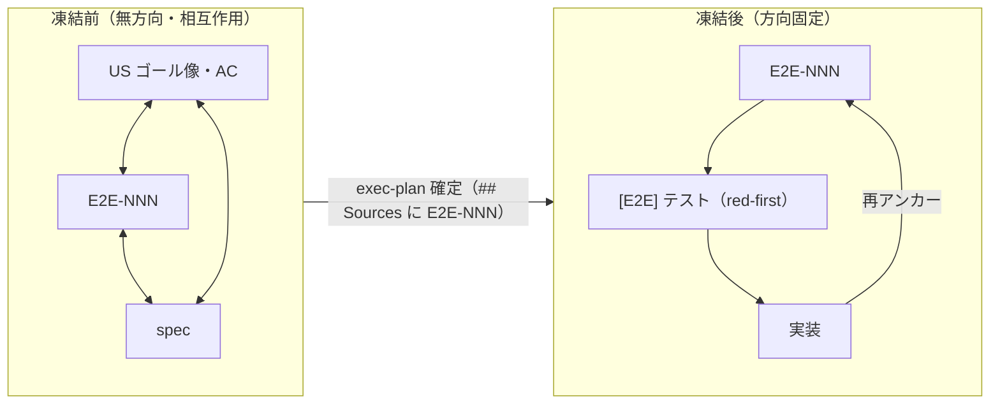

# E2E interaction — when a scenario freezes, and what to do when it says more than the ACs

> **Single source.** `create-exec-plan` (Q3b, before the plan is finalized), `run-exec-plan`
> (Step 0c), `start-feature` (Step 2), `create-spec` (the draft report), `doc-review` (§2b) and
> `promote-spec` (the reconcile plan's Decision Log) all apply **this** file. Do not
> restate the freeze point, the complement branches or the record format inline in a skill —
> reference this file, so the call sites cannot drift apart.

## Why this exists

An `E2E-NNN` scenario is not simply derived from the requirements. It is where the requirements are
checked against the whole: written down end to end, a journey routinely turns up a step nobody wrote
an AC for, or a result the spec never mentions. When the requirements are loose, the scenario is
what fills them in; when the requirements or the spec change, the scenario changes with them.
**Which one comes first cannot be fixed** (#37).

Two consequences pull in opposite directions:

- **A scenario that fills a gap is the most useful thing it does.** It is how a missing requirement
  is *discovered*.
- **A scenario that fills a gap silently decides what to build.** The `[E2E]` test is transcribed
  from the scenario, so an outcome stated only there becomes something the loop must make green —
  a requirement no human wrote as one, reaching the implementation through the back door. That is
  the outer gate (CLAUDE.md「自律実装ループ」) bypassed.

This file keeps the first and closes the second, by separating *when* the scenario may move from
*how* a gap it reveals is decided.

---

## The freeze point

> **An `E2E-NNN` freezes, for a plan, when that plan is finalized with the scenario named in its
> `## Sources`.**

| | Before the freeze | After the freeze |
|---|---|---|
| Direction | None — the scenario, the US and the spec may each change the others, in any order | Fixed: scenario → `[E2E]` test (red-first) → implementation → re-anchor against the scenario |
| A gap the scenario reveals | Decided by a human while the plan is written (「Where this is applied」 below) | Should not exist — if one appears, the scenario or its ACs moved after the freeze, and the driver halts |
| Changing the scenario | Ordinary authoring | A **spec change**. Route it per CLAUDE.md「仕様バージョンの管理」: a fix to the current version goes to `main` and is recorded in the in-flight plan's Decision Log; a next-version change goes to `spec/<label>` and does not reach the plan until promotion |



上図は、E2E が凍結前は US・spec と双方向に補完し合い、そのシナリオを起点に書いた exec-plan の確定を
境に「起点 → テスト → 実装 → 再アンカー」の一方向へ切り替わることを示す。

**Why the plan, and not something earlier or later.** Freezing at spec approval would forbid the
scenario from ever filling a gap after the spec is written, which is the interaction this file
exists to allow. Freezing when each test is drafted would give one plan several freeze times, AC by
AC, and red-first (`../run-tests/red-first.md`) needs the whole plan's target fixed before the first
test is written. The plan is also the unit that already carries the `## Sources` row naming the
scenario, so the freeze needs no record of its own: the row and the plan's `created:` date are it.

**What the freeze protects, and how a change after it surfaces.** Nothing marks a scenario as frozen,
and nothing needs to: every place the driver reads it already compares it with something frozen.

| The scenario now differs from… | Detected at | Stop condition |
|--------------------------------|-------------|----------------|
| The `[E2E]` AC line (a different 完了条件) | `run-exec-plan` Step 0c / 3a — the contradiction row of [`ac-sources.md`](ac-sources.md) | (a) |
| A frozen `[E2E]` test expectation (the red-first record exists) | `run-exec-plan` Step 0c on resume (it reads the scenario for the check below before re-running the placed test) and Step 3a (the re-anchor reads it against the implemented flow) | (c) — a frozen expectation changes only through the spec change that moved it (INV-T01 / INV-T02) |
| Its own `満たす AC` — it now states an outcome they do not | `run-exec-plan` Step 0c — the complement check below | (a) |

---

## The complement check

`ac-sources.md` compares a source with **the AC line** it refines. This check compares the scenario
with **the requirements underneath it**: does each outcome the scenario states have an AC that
builds it?

**What is compared.** The scenario's **完了条件** and the **observable result of each step**,
against the US `### AC-NNN` sections and the spec sections marked "satisfies AC-NNN" for every AC in
the scenario's `満たす AC`. 前提 is the starting state and is not compared. A step that only moves
the user along (opens a screen, follows a link) and produces no result of its own is not compared
either — a test does not assert it.

**Where those sections are.** `満たす AC` usually names ACs outside the plan at hand, so the plan's
`## Sources` table does not list them all. Find each AC's US file by its `ac_ids:` frontmatter and its
spec section by "satisfies AC-NNN". Both are frozen spec material, so reading them is within what
`ac-sources.md` admits; they are read for this check only, and an expected value for this plan's tests
still comes from this plan's own sources.

| What the scenario states, against its `満たす AC` | What it is | Action |
|---------------------------------------------------|-----------|--------|
| **Refinement** — an outcome one of those sections states, with the concrete values or sequence the scenario adds | Not a complement. This is the whole-flow detail the sections leave out | Use it |
| **An outcome no AC backs** — none of those sections states it | **A detected requirement gap.** Not detail of the scenario — the scenario has found something nobody wrote down as a requirement | A human decides, one of: **① 昇格** — write it into the requirements or the spec and give it an AC; **② 削除** — drop it from the scenario, because it is not part of the finished thing; **③ 要件の書き直し** — the requirements are too thin to judge it, so rewrite the US before deciding. Whatever is decided, the scenario and its `満たす AC` agree again afterwards |
| **Contradiction** — an outcome those sections state, with a different result | Two frozen documents disagree | **HALT** with (a) wherever the driver meets it. Change neither — which one is right is a spec judgement |
| **Nothing to compare** — the scenario has no `満たす AC`, or none of them has a US or spec section (`/create-spec` skipped and the journey taken from the US goal image) | No requirements underneath to check against | Record `n/a（理由）` and continue |

Option ① and the goal image: an outcome that the US `## ゴール像` names but no AC section does is
still **an outcome no AC backs** — the goal image says the thing is wanted, not that anything builds
it. That is the evidence a human weighs for ①, not a reason to skip the decision.

**Why a human, and why never the driver.** All three options decide *what to build*. ① adds a
requirement, ② removes part of the finished picture, ③ reopens the requirements. Choosing among them
is outer-gate in exactly the sense CLAUDE.md gives it, and the driver picking one — including by
quietly implementing the outcome so the `[E2E]` test turns green — is the back door this file closes.

**Record format** — in the plan's `## Decision Log`:

```markdown
- E2E-NNN 補完検出（{地点}）: 完了条件・各ステップを 満たす AC（AC-001, AC-003）の US 節・spec 節と照合。
  {一致 — すべて詳細化 | 裏づけの無い成果 {n} 件: 「{成果}」→ 人の決定: ①昇格（{どこへ}）/②削除/③要件の書き直し | 矛盾: 「{成果}」— {どちら} と食い違う → HALT (a) | n/a（{理由}）}
```

As with every exemption in DocDD, the `n/a` line is the record; silence is not an exemption.

---

## Where this is applied

The check is run with the same criteria wherever a scenario is about to become a target or is
reviewed. Only two sites stop: the ones where a plan is fixed as a target and the work is about to
follow it. The difference between them is whether a human is present to decide, the same split as
`ac-readiness.md` and `ac-sources.md`.

| Call site | When | Action |
|-----------|------|--------|
| `create-exec-plan` (Q3b, before the plan is finalized) | Deriving each `[E2E]` AC from its `E2E-NNN` — the moment the scenario is about to freeze | Run the check on every scenario the plan's `[E2E]` ACs name. An outcome no AC backs → present it and decide ①/②/③ **with the user**; do not finalize the plan until the scenario and its `満たす AC` agree. A contradiction → resolve it with the user the same way. Record the result per scenario. If the user declines to decide, record that — a later `run-exec-plan` will still halt on it (intended). **A preservation `[E2E]` AC** (refactoring): present and record the finding, and the plan may be finalized without resolving it — the same exemption as Step 0c below, so the plan is not blocked here for a gap the loop would let through |
| `run-exec-plan` (Step 0c, before transcribing each `[E2E]` test — on every entry, resume included) | The scenario is frozen and the driver is about to turn it into a test | Run the check again. An outcome no AC backs, or a contradiction → **HALT** with (a): the scenario or its ACs moved after the freeze, or the check was skipped. **A preservation `[E2E]` AC** (the existing flow must keep working, and an existing test already covers it) **is exempt from halting**: nothing is about to be built, so record the finding and continue |
| `start-feature` (Step 2) | Manual path, before the `[E2E]` test is written | Run the check on each scenario a `[E2E]` AC names. A finding is presented to the user to decide ①/②/③ — a conversation, not a halt. Record the decision in the Progress Log |
| `promote-spec` (Step 7) | Writing a reconcile plan, which does not go through `create-exec-plan` | Does not run the check. The reconcile plan's Decision Log says so, and names `start-feature` Step 2 / `run-exec-plan` Step 0c as where it happens — the same deferral the reconcile plan already records for readiness |
| `create-spec` (the draft report) | Drafting scenarios from the US goal image | Report each outcome no AC backs as a complement candidate in the draft report. The human decides when approving the spec — the skill does not add ACs or drop steps itself |
| `doc-review` (§2b) | Optional review of a spec or a plan | Report outcomes no AC backs and contradictions (advisory) |

**When the decision changes a scenario whose test is already placed.** A halt at Step 0c normally
comes before the `[E2E]` test is transcribed, so resolving it changes nothing frozen. But a scenario
can move after its test was placed — found on a resumed Step 0c — and then ② or ③ changes an
expectation that a red-first record froze. That is stop condition (c), not a fresh start: the human
records the change in the Decision Log, tied to the spec change that caused it (INV-T01), and the
test is re-transcribed red-first from the changed scenario before the run resumes. Step 0c's "already
placed — re-run it, do not rewrite it" row does not apply to that test: re-running it would steer the
loop toward an outcome that was just removed.

Why a preservation `[E2E]` AC does not halt: the danger this file guards against is the driver
*building* an outcome nobody required. Under a preservation AC the outcome already exists and is
already tested; the gap is between documents, not between documents and code. It is still a gap —
the record is what keeps it from being silent.

Why `create-spec`, `start-feature` and `doc-review` do not stop: a spec draft is reviewed and
approved by a human anyway, `start-feature` has the human who decides right there, and a review is
advisory by definition. Stopping at any of them would add gates without adding a decision point.

---

## Relationship to the other checks

| Check | The question it asks |
|-------|----------------------|
| AC readiness (`ac-readiness.md`) | Can this criterion be measured at all? |
| AC sources (`ac-sources.md`) | Does the implementer receive the whole goal — and does a source say more than, or something other than, **the AC line**? |
| `[E2E]` coverage | Do the fragments add up to something the user can do? |
| **E2E interaction** (this file) | Does the scenario say more than **the ACs underneath it** — and if so, who decided that it should? |

`ac-sources.md`'s "separate outcome" row and this file's "outcome no AC backs" row are the same
shape one level apart: there the source exceeds the AC line, here the scenario exceeds its ACs. Both
are discoveries, both are decided by a human, and both halt the unattended loop.
