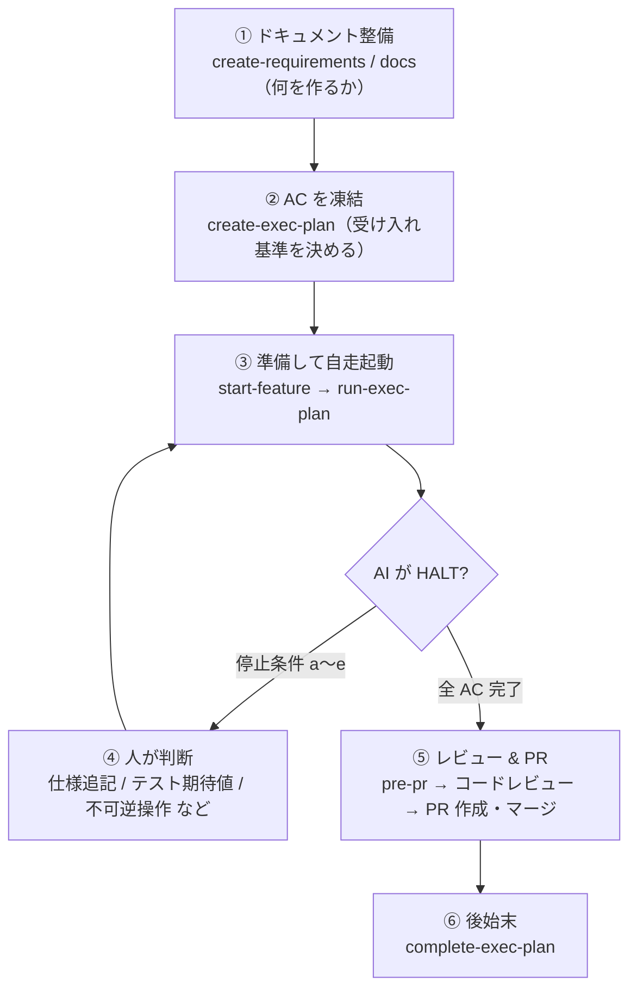

# DocDD 導入マニュアル

ドキュメント駆動開発（DocDD）を既存または新規プロジェクトに導入するための手順書です。

> For the English version, see [ONBOARDING.md](ONBOARDING.md).

---

## 目次

1. [DocDD とは何か](#1-docdd-とは何か)
2. [前提条件](#2-前提条件)
3. [ケース A: 新規プロジェクト（ドキュメントなし）](#3-ケース-a-新規プロジェクトドキュメントなし)
4. [ケース B: 既存プロジェクト（ドキュメントあり）](#4-ケース-b-既存プロジェクトドキュメントあり)
5. [自動化の仕組み（フック）](#5-自動化の仕組みフック)
6. [日常の開発フロー](#6-日常の開発フロー)
7. [ドキュメント作成ルール](#7-ドキュメント作成ルール)
8. [トラブルシューティング](#8-トラブルシューティング)

---

## 1. DocDD とは何か

DocDD は「コードと常に同期した生きたドキュメント」を軸に置き、AI エージェント（Claude Code）が正しい文脈で開発フロー全体を進められるようにする開発手法です（実装などの「実行」は AI が自走し、AC 凍結・仕様変更・PR マージなどの「決定」は人が担う）。

```
ドキュメント  = 定義（何を作るか）
スキル        = 操作（どうやって進めるか）
settings.json = トリガー（いつ自動確認するか）
```

### DocDD がなければ何が起きるか

| 問題 | 結果 |
|------|------|
| 仕様なしに実装が始まる | AI がコンテキスト不足のまま動く |
| テスト失敗時に「とりあえず直す」 | テストが仕様ではなく実装に追従する |
| ドキュメントを更新し忘れる | コードとドキュメントが乖離していく |

DocDD は **仕様ファーストゲート**（spec-gate）と **スキル群**によって、これらを構造的に防ぎます。

---

## 2. 前提条件

| 要件 | 詳細 |
|------|------|
| Claude Code | インストール済み・プロジェクトで使用可能であること |
| Git リポジトリ | 対象プロジェクトが `git init` 済みであること |
| Python 3 | `python3` コマンドが利用可能であること（フック実行に使用） |
| DocDD テンプレート | このリポジトリへのアクセス |

---

## 3. ケース A: 新規プロジェクト（ドキュメントなし）

ゼロからプロジェクトを始める場合の最短手順です。

### 手順

#### Step 1: ファイルをコピーする

DocDD テンプレートから以下の 2 つをプロジェクトルートにコピーします。

```
your-project/
├── .claude/          ← テンプレートの .claude/ をそのままコピー
│   ├── hooks/
│   ├── settings.json
│   └── skills/
└── CLAUDE.md         ← テンプレートの CLAUDE.md をそのままコピー
```

> **注意**: `.claude/settings.local.json` はコピー不要です。各開発者のローカル設定なので git 管理外で構いません。

コピーコマンド例:

```bash
# テンプレートリポジトリを clone またはダウンロード後
cp -r DocDDTemplate/.claude your-project/.claude
cp DocDDTemplate/CLAUDE.md  your-project/CLAUDE.md
```

#### Step 2: プロジェクトを初期化する

コピー先のプロジェクトで Claude Code を開き、以下を実行します。

```
/init-project
```

Claude が以下の 4 つの質問をインタビュー形式で行います（一問ずつ）。

| 質問 | 答える内容 |
|------|-----------|
| Q1. プロジェクト概要 | 目的・対象ユーザー・主要機能を 3 行以内で |
| Q2. 技術スタック | 言語・フレームワーク・DB・配布方法と選定理由 |
| Q3. 開発ルール | ブランチ戦略・PR/レビュー方針・テスト方針・AI 関与度 |
| Q4. プラットフォーム | Windows (WPF/.NET)・Web (React/ASP.NET)・その他 |

インタビュー完了後、以下が自動生成されます。

**Phase 0（共通）:**
- `docs/00_project/overview.md` — プロジェクト概要
- `docs/00_project/decisions.md` — 技術選定 ADR
- `docs/07_ai_context/CONTEXT.md` — ナビゲーションマップ

**Phase 1（プラットフォーム別）:**
- `docs/01_requirements/` — 要件・ユーザーストーリー
- `docs/03_design/` — アーキテクチャ・データモデル
- `docs/04_implementation/` — 不変条件・パターン・依存関係
- `docs/05_quality/` — テスト戦略・レビューチェックリスト

#### Step 3: 機能実装を開始する

ドキュメント生成後は [日常の開発フロー](#6-日常の開発フロー) に進みます。

---

## 4. ケース B: 既存プロジェクト（ドキュメントあり）

すでにドキュメントが存在するプロジェクトに DocDD を後から導入する場合、以下の 2 つの方針を選択します。

### 方針の選択基準

| 状況 | 推奨方針 |
|------|---------|
| ドキュメント量が少ない・構造が未整備 | **方針 1: スキルに合わせてドキュメントを整備** |
| ドキュメントが多く・独自の構造が確立している | **方針 2: ドキュメントに合わせてスキルを調整** |
| ドキュメント構造が DocDD と似ている | **方針 1 + 部分的な移行** |

---

### 方針 1: スキルに合わせてドキュメントを整備する

DocDD のディレクトリ構造に既存ドキュメントをマッピングするアプローチです。

#### Step 1: .claude/ と CLAUDE.md をコピーする

ケース A と同じ手順で `.claude/` と `CLAUDE.md` をコピーします。

#### Step 2: 既存ドキュメントを DocDD 構造に移行する

既存ドキュメントを以下のディレクトリに移行・再構成します。

```
docs/
├── 00_project/
│   ├── overview.md       ← プロジェクト概要（README.md から移植可）
│   └── decisions.md      ← 技術選定理由（ADR 形式に変換）
├── 01_requirements/
│   └── user_stories/     ← 要件定義・ユーザーストーリー
├── 02_spec/
│   └── app_spec.md       ← アプリ仕様（アプリが何をするか）
├── 03_design/
│   ├── architecture.md   ← アーキテクチャ図
│   └── data_model.md     ← ER 図・スキーマ定義
├── 04_implementation/
│   ├── invariants.md     ← 不変条件（最重要: 必ず作成）
│   └── patterns.md       ← 実装パターン・規約
├── 05_quality/
│   ├── test_strategy.md  ← テスト戦略
│   └── review_checklist.md
└── 07_ai_context/
    └── CONTEXT.md        ← ナビゲーションマップ（最重要: 必ず作成）
```

> **最低限必要なファイル**: `docs/04_implementation/invariants.md` と `docs/07_ai_context/CONTEXT.md` の 2 つ。この 2 ファイルがないと `/start-feature` が動作しません。

#### Step 3: CONTEXT.md を手動作成する

既存プロジェクトの状況を反映した `CONTEXT.md` を作成します。

```markdown
---
status: active
---

## プロジェクト概要
（プロジェクトの目的・対象ユーザー・主要機能を 3 行以内で）

## 技術スタック
| 区分 | 内容 |
|------|------|
| 言語 | |
| FW   | |
| DB   | |

## 開発ルール
- ブランチ戦略: 
- PR/レビュー: 
- テスト方針: 
- AI 関与度: 

## ドキュメント構成
（主要ドキュメントへのリンク）

## 現在のフェーズと優先タスク
Phase: Phase X
次のアクション → exec-plans/active/ を参照

## 参照ドキュメント
- docs/00_project/overview.md
- docs/04_implementation/invariants.md
```

#### Step 4: 各ドキュメントにフロントマターを追加する

DocDD のドキュメント鮮度チェック（`check-doc-freshness`）が動作するために、ドキュメントに `tracks:` フィールドを追加します。

```yaml
---
status: active
tracks:
  - src/**/models/**
  - src/**/repositories/**
---
```

`tracks:` フィールドがないドキュメントは鮮度チェックの対象外になります。

---

### 方針 2: ドキュメントに合わせてスキルを調整する

独自のドキュメント構造を維持しつつ、スキルのパスや期待するファイル名を変更するアプローチです。

#### 調整が必要なファイル一覧

| ファイル | 変更箇所 | 具体例 |
|---------|---------|-------|
| `.claude/skills/*/SKILL.md` | ドキュメントパスの参照箇所 | `docs/07_ai_context/CONTEXT.md` → `my-docs/context.md` |
| `.claude/skills/start-feature/SKILL.md` | Step 2 の読み込みドキュメント一覧 | パスを自分のドキュメント構造に合わせる |
| `.claude/skills/check-doc-freshness/SKILL.md` | `tracks:` フィールドの探索対象 | 独自ディレクトリを追加 |
| `.claude/skills/init-project/SKILL.md` | Phase 0/1 の生成ファイルリスト | 不要なドキュメントを除外 |
| `CLAUDE.md` | スキル一覧の説明 | 不要なスキルを削除 |

#### 最小限の変更で DocDD を導入する場合

スキル全体を変更するのが大きい場合、以下の最小セットだけを導入することも可能です。

**必須（コアの仕組み）:**
- `.claude/hooks/spec-gate.py` — 仕様ファーストゲート
- `.claude/hooks/post-tool-notify.py` — コード変更後の通知
- `.claude/settings.json` — フックの設定
- `CLAUDE.md` — Claude への行動規範（図ルール・スキル一覧を含む）
- `.claude/skills/create-exec-plan/` — 実行計画の作成
- `.claude/skills/pre-pr/` — PR 前チェック

**省略可能（あると便利）:**
- `.claude/skills/create-requirements/` — User Story 定義（要件が曖昧な場合に有効）
- `init-project/` — 新規プロジェクト向け（既存ドキュメントがあれば不要）
- `check-doc-freshness/` — `tracks:` フィールドを整備するまで不要
- `gc/` — 週次メンテナンス（初期は不要）

---

## 5. 自動化の仕組み（フック）

`.claude/settings.json` に 2 種類のフックが設定されています。

### フック 1: 仕様ファーストゲート（UserPromptSubmit）

**タイミング**: ユーザーがメッセージを送信した瞬間（Claude が処理する前）

**動作**: 実装の意図（「実装して」「コードを書いて」「fix」など）を検知したとき、以下を確認します。

```
状態                              → Claudeの応答
──────────────────────────────────────────────────
exec-plans/active/ が空           → /create-exec-plan を提案、実装しない
exec-plan に AC-001〜 がない      → AC の追加を求め、実装しない
AC はあるが AC 番号を指定していない → 「どの AC を実装しますか？」と確認、実装しない
AC 番号が指定されている           → 実装を開始する
```

> **例外処理**: ユーザーが「仕様なしで進めることを確認します」と明示的に言った場合のみ、`exec-plans/.spec-override` ファイルが作成されてゲートをスキップできます。

### フック 2: 変更後の通知（PostToolUse）

**タイミング**: Claude がファイルを Write または Edit した後

| 変更対象 | 通知内容 |
|---------|---------|
| `exec-plans/completed/` | `update-context` の実行を促す |
| `exec-plans/active/` | CONTEXT.md の優先タスク更新を確認する |
| テストファイル (`*.Test.cs`, `*.test.ts` 等) | 変更が AC-ID に基づいているか確認する |
| コードファイル（上記以外） | `check-doc-freshness` の実行と仕様照合ゲートを促す |

> **注意**: これらのフックは **警告通知のみ** で実行をブロックしません。確認を促すメッセージが Claude に渡されます。

### フックが動かない場合

| 症状 | 確認箇所 |
|------|---------|
| フックがまったく反応しない | `python3` が PATH に存在するか確認 |
| Windows で動作しない | `python3` ではなく `python` が必要な場合、`settings.json` の `command` を修正 |
| 仕様ゲートが誤検知する | `spec-gate.py` の `IMPL_PATTERNS` / `DOC_ONLY_PATTERNS` を調整 |

---

## 6. 日常の開発フロー

### 6-0. 人が何をするか（責任分担）

DocDD では **「決定」は人、「実行」は AI** に分ける。人の主な仕事は **ドキュメントの整備とレビュー**で、実装を進めるための指示は最小化される。

#### A. 人が直接使うスキル / AI が内部で回すスキル

下表は日常の実装フローで使う主要スキル。これ以外に `init-project`（導入時に一度）と `doc-review` / `docode-review`（任意の独立レビュー）があり、スキルは全部で 16 個。日常的に意識するのは下表だけでよい。

| 層 | スキル | 人の関わり方 |
|----|--------|------------|
| 人が直接使う（統治・判断） | `create-requirements` / `create-exec-plan` / `start-feature` / `run-exec-plan` / `pre-pr` / `complete-exec-plan`<br>周期: `promote-spec` / `gc` | 人が起動し、判断する |
| AI が内部で回す（実行・検証） | `run-tests` / `check-invariants` / `check-doc-freshness` / `check-doc-invariants` / `update-context` | 人は直接呼ばない（上位スキルが自動で回す） |

> 人が起動するのは上段（**6 ＋ 周期 2**）。`start-feature` は機能ごとに一度、自走を始める前の準備として起動する。下段の検証スキルは、上段スキルがそれぞれ必要な範囲で内部呼び出しする（例: `run-tests` は `start-feature` / `run-exec-plan` / `pre-pr` / `complete-exec-plan`、`check-*` は `run-exec-plan` / `pre-pr` / `gc`）。`update-context` は `gc` から呼ばれる（`complete-exec-plan` は CONTEXT.md を直接更新し、`update-context` は呼ばない）。

#### B. 人間視点のフロー



上図のボックス ①②③④⑤⑥ はいずれも人が起動する操作（③ は機能ごとに一度 `start-feature` で準備してから `run-exec-plan` を起動する）。ただし ③ で起動した後の「実装→テスト→修正→次 AC」のループ（C↔D）は AI が自走し、人は AI が停止条件（CLAUDE.md「自律実装ループ」の a〜e）で HALT したとき（④）だけ戻ればよい。人の実装指示は基本「AC 番号を渡す」だけ。

#### C. 責任分担表

| フェーズ | 人の責任 | AI の責任 |
|---------|---------|----------|
| 要件・仕様 | User Story / AC を定義・凍結する | 対話で引き出し、ドラフトを書く |
| 実装・検証 | （指示は AC 番号のみ） | 実装→テスト→修正→次 AC を自走、`run-tests` / `check-*` を内部実行 |
| 仕様変更・テスト期待値 | 変更可否を判断する（外側ゲート） | 変更が必要だと検知したら停止・提示する |
| レビュー・PR | コードをレビューし PR を承認・マージする | `pre-pr` で総合チェックを実行する |
| 昇格・GC | `promote-spec` / `gc` の実行可否を判断する | 差分解析・後処理を支援する |

> スキルの依存関係を含む全体の詳細フローは [`SKILL_FLOW.md`](SKILL_FLOW.md) を参照。

### 全体の流れ

```
0. /create-requirements → User Story・AC 条件を定義（任意・推奨）
1. /create-exec-plan    → 実装計画・受け入れ基準（AC）を定義
2. /start-feature       → ドキュメント確認・ブランチ作成
3. /run-exec-plan       → AC を 1 つずつ自走実装（実装→テスト→修正→次 AC）
                          内部で /run-tests・/check-invariants・/check-doc-freshness を自動実行
                          停止条件（a〜e）に当たったときだけ人に確認
4. /pre-pr              → PR 前の総合チェック
5. PR 作成 → レビュー → マージ
6. /complete-exec-plan  → 計画を completed/ へ移動
```

> `/run-exec-plan` は opt-in。1 つずつ手動で進めたい場合は、Step 3 を「コードを書く →
> `/check-doc-freshness` → `/check-invariants` → `/run-tests`」の手動ループに置き換えてもよい。

### `/create-requirements` と `/create-exec-plan` の使い分け

| スキル | 目的 | 生成物 |
|-------|------|-------|
| `/create-requirements` | **何を作るか**を定義する（User Story + AC 条件） | `docs/01_requirements/user_stories/US-XXX_{name}.md` |
| `/create-exec-plan` | **どう作るか**を計画する（タスク分解 + 進捗管理） | `exec-plans/active/YYYY-MM-{name}.md` |

`/create-requirements` は任意ですが、チームで開発する場合や「何を作るか」が曖昧なときに先に実行しておくと、`/create-exec-plan` の AC 定義がより明確になります。`/create-requirements` が完了すると、「次のステップ: `/create-exec-plan` を実行してください。推奨 AC: AC-001, AC-002, ...」と案内されます。

### テスト失敗時の判断ゲート（重要）

テストが失敗したとき、**すぐにテストを修正しない**でください。

```
A) テストは仕様を正しく表現している
   → 実装にバグがある → 実装を修正する

B) 仕様が変更された・テストが古い
   → 仕様（AC-ID）に基づいてテストを修正する
   ⚠️ 実装の挙動に合わせたテスト修正は禁止（INV-T01）
```

### AC-ID によるトレーサビリティ

テストコードには対応する AC-ID を記載します。

```csharp
// C# / xUnit
[Trait("AC", "AC-001")]
public void Login_WithInvalidPassword_Returns401() { ... }
```

```typescript
// TypeScript / Vitest
describe('AC-001: 無効なパスワードでのログイン', () => {
  it('401 を返す', () => { ... });
});
```

---

## 7. ドキュメント作成ルール

CLAUDE.md に定義されている図・ダイアグラムの規則です。DocDD のすべてのスキルとドキュメントに適用されます。

| 状況 | ルール |
|------|--------|
| フロー・シーケンス・クラス図など | **Mermaid を優先して使用する** |
| Mermaid で表現できない図（UI スケッチ・2D レイアウト等） | AA（アスキーアート）を使用し、**直後に必ず図の説明文を添える** |

**AA の記載例:**

```
┌──────────┬──────────┐
│ ファイル名 │ タグ     │
└──────────┴──────────┘
```

上図はファイル一覧画面のレイアウト。左列にファイル名、右列に付与済みタグを表示する。
行を選択するとタグ編集パネルが右側にスライドインする。

> **なぜこのルールが必要か**: AA のみだと図の意図が伝わらずドキュメントが形骸化します。説明文を必ず添えることで、コードを読まない人（AI を含む）でも意図を理解できます。

---

## 8. トラブルシューティング

### Q: 仕様ゲートが誤検知して、ドキュメント操作もブロックされる

**原因**: `spec-gate.py` の正規表現がドキュメント編集の指示にマッチしている。

**対処**: `spec-gate.py` の `DOC_ONLY_PATTERNS` に除外パターンを追加するか、CLAUDE.md の例外処理を使って `exec-plans/.spec-override` を作成します。

```bash
# 一時的に仕様ゲートをスキップ
touch exec-plans/.spec-override
# 作業完了後に削除
rm exec-plans/.spec-override
```

---

### Q: `/start-feature` が「`invariants.md` が存在しません」と言う

**原因**: Phase 1 のドキュメント生成が完了していない。

**対処**:
- 新規プロジェクトなら `/init-project` を先に実行する
- 既存プロジェクトなら `docs/04_implementation/invariants.md` を手動作成する

```markdown
---
status: active
tracks:
  - src/**
---

# 不変条件

## INV-T01: テスト修正ルール
テストを修正する場合は、対応する AC-ID を必ず確認すること。
実装の挙動に合わせたテスト修正は禁止。
```

---

### Q: `check-doc-freshness` が何も検出しない

**原因**: ドキュメントに `tracks:` フィールドが設定されていない。

**対処**: 各ドキュメントのフロントマターに `tracks:` を追加します。

---

### Q: 既存の `exec-plans/` がなくて `/pre-pr` がエラーになる

**原因**: `exec-plans/active/` ディレクトリが存在しない。

**対処**: `/create-exec-plan` を実行するとディレクトリが自動作成されます。手動で作成しても構いません。

```bash
mkdir -p exec-plans/active exec-plans/completed
```

---

### Q: チームで導入する場合、誰が何をすればよいか

| 作業 | 担当 | タイミング |
|------|------|-----------|
| `.claude/` と `CLAUDE.md` のコピー | リポジトリ管理者 | 導入時（1 回） |
| `/init-project` の実行とドキュメント生成 | リポジトリ管理者 | 導入時（1 回） |
| `python3` が使えることの確認 | 各開発者 | 初回セットアップ時 |
| 日常の `/create-requirements` → `/create-exec-plan` → `/pre-pr` フロー | 各開発者 | 機能実装のたびに |

---

## まとめ

| ケース | 手順 |
|--------|------|
| 新規プロジェクト | `.claude/` コピー → `CLAUDE.md` コピー → `/init-project` |
| 既存プロジェクト（ドキュメント少） | `.claude/` コピー → `CLAUDE.md` コピー → `CONTEXT.md` と `invariants.md` を手動作成 → スキルを使い始める |
| 既存プロジェクト（独自構造が確立） | `.claude/` コピー → スキルのパスを独自構造に合わせて編集 → 最小限のスキルから始める |

迷ったら **最小限セット**（`spec-gate.py` + `CLAUDE.md` + `create-exec-plan` + `pre-pr`）から始めて、必要に応じてスキルを追加していくのが安全です。`create-requirements` は要件が曖昧になりがちなチーム開発で特に効果的です。
