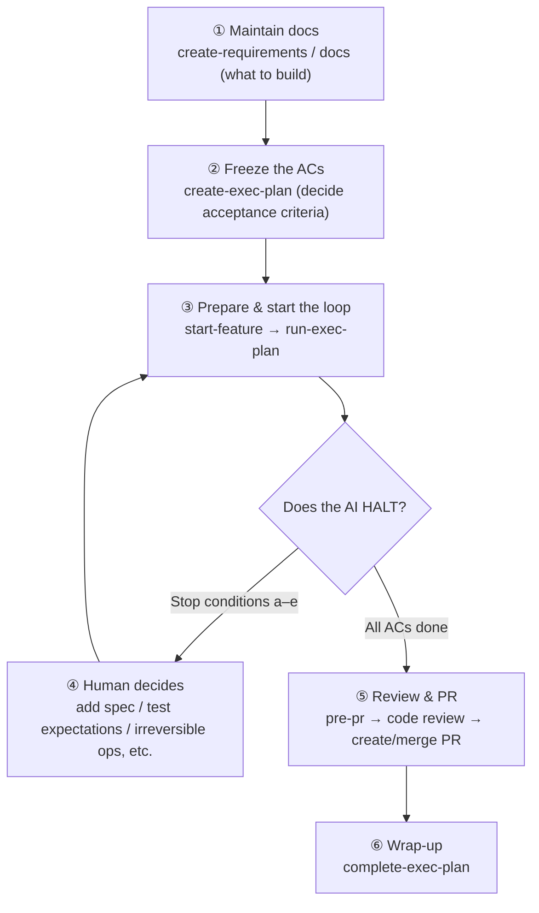

# DocDD Onboarding Guide

A step-by-step guide for adopting Document-Driven Development (DocDD) in an existing or new project.

> 日本語版は [ONBOARDING.ja.md](ONBOARDING.ja.md) を参照してください。

---

## Table of Contents

1. [What is DocDD](#1-what-is-docdd)
2. [Prerequisites](#2-prerequisites)
3. [Case A: New project (no docs)](#3-case-a-new-project-no-docs)
4. [Case B: Existing project (with docs)](#4-case-b-existing-project-with-docs)
5. [Automation mechanism (hooks)](#5-automation-mechanism-hooks)
6. [Daily development flow](#6-daily-development-flow)
7. [Documentation authoring rules](#7-documentation-authoring-rules)
8. [Troubleshooting](#8-troubleshooting)

---

## 1. What is DocDD

DocDD is a development methodology built around "living documentation that stays in sync with the code," letting an AI agent (Claude Code) drive the development flow with the right context — the AI runs the *execution* (implementation, etc.) autonomously, while the human keeps the *decisions* (freezing ACs, changing the spec, merging PRs).

```
Documentation  = Definition (what to build)
Skills         = Operation  (how to proceed)
settings.json  = Triggers   (when to check automatically)
```

### What happens without DocDD

| Problem | Result |
|---------|--------|
| Implementation starts with no spec | The AI works without enough context |
| "Just fix it" when a test fails | Tests follow the implementation instead of the spec |
| Forgetting to update docs | Code and documentation drift apart |

DocDD structurally prevents these through the **spec-first gate** (spec-gate) and the **skill set**.

---

## 2. Prerequisites

| Requirement | Detail |
|-------------|--------|
| Claude Code | Installed and usable in the project |
| Git repository | The target project has been `git init`-ed |
| Python 3 | The `python3` command is available (used to run hooks) |
| DocDD template | Access to this repository |

---

## 3. Case A: New project (no docs)

The shortest path when starting a project from scratch.

### Steps

#### Step 1: Copy the files

Copy the following two items from the DocDD template to your project root.

```
your-project/
├── .claude/          ← Copy the template's .claude/ as-is
│   ├── hooks/
│   ├── settings.json
│   └── skills/
└── CLAUDE.md         ← Copy the template's CLAUDE.md as-is
```

> **Note**: `.claude/settings.local.json` does not need to be copied. It is each developer's local setting and may stay out of git.

Example copy commands:

```bash
# After cloning or downloading the template repository
cp -r DocDDTemplate/.claude your-project/.claude
cp DocDDTemplate/CLAUDE.md  your-project/CLAUDE.md
```

#### Step 2: Initialize the project

Open Claude Code in the copied project and run:

```
/init-project
```

Claude conducts an interview with the following 4 questions (one at a time).

| Question | What to answer |
|----------|----------------|
| Q1. Project overview | Purpose, target users, and main features in 3 lines or fewer |
| Q2. Tech stack | Language, framework, DB, distribution method, and the rationale |
| Q3. Development rules | Branch strategy, PR/review policy, test policy, level of AI involvement |
| Q4. Platform | Windows (WPF/.NET), Web (React/ASP.NET), or other |

After the interview, the following are generated automatically.

**Phase 0 (common):**
- `docs/00_project/overview.md` — Project overview
- `docs/00_project/decisions.md` — Tech-selection ADR
- `docs/06_ai_context/CONTEXT.md` — Navigation map

**Phase 1 (per platform):**
- `docs/01_requirements/` — Requirements / user stories
- `docs/02_design/` — Architecture / data model
- `docs/03_implementation/` — Invariants / patterns / dependencies
- `docs/04_quality/` — Test strategy / review checklist

#### Step 3: Start feature implementation

After docs are generated, proceed to the [daily development flow](#6-daily-development-flow).

---

## 4. Case B: Existing project (with docs)

When adopting DocDD into a project that already has documentation, choose one of the following two approaches.

### Criteria for choosing an approach

| Situation | Recommended approach |
|-----------|---------------------|
| Few docs / unstructured | **Approach 1: Adapt the docs to the skills** |
| Many docs / an established custom structure | **Approach 2: Adapt the skills to the docs** |
| Doc structure is similar to DocDD | **Approach 1 + partial migration** |

---

### Approach 1: Adapt the docs to the skills

An approach that maps existing docs onto the DocDD directory structure.

#### Step 1: Copy .claude/ and CLAUDE.md

Copy `.claude/` and `CLAUDE.md` using the same steps as Case A.

#### Step 2: Migrate existing docs into the DocDD structure

Migrate and reorganize existing docs into the following directories.

```
docs/
├── 00_project/
│   ├── overview.md       ← Project overview (can be ported from README.md)
│   └── decisions.md      ← Tech-selection rationale (convert to ADR format)
├── 01_requirements/
│   └── user_stories/     ← Requirements / user stories
├── 02_design/
│   ├── architecture.md   ← Architecture diagrams
│   └── data_model.md     ← ER diagrams / schema definitions
├── 03_implementation/
│   ├── invariants.md     ← Invariants (most important: must create)
│   └── patterns.md       ← Implementation patterns / conventions
├── 04_quality/
│   ├── test_strategy.md  ← Test strategy
│   └── review_checklist.md
└── 06_ai_context/
    └── CONTEXT.md        ← Navigation map (most important: must create)
```

> **Minimum required files**: `docs/03_implementation/invariants.md` and `docs/06_ai_context/CONTEXT.md`. Without these two, `/start-feature` will not work.

#### Step 3: Create CONTEXT.md manually

Create a `CONTEXT.md` that reflects the state of the existing project.

```markdown
---
status: active
---

## Project overview
(Purpose, target users, and main features in 3 lines or fewer)

## Tech stack
| Category | Content |
|----------|---------|
| Language | |
| FW       | |
| DB       | |

## Development rules
- Branch strategy:
- PR/review:
- Test policy:
- Level of AI involvement:

## Document structure
(Links to the main documents)

## Current phase and priority tasks
Phase: Phase X
Next action → see exec-plans/active/

## Reference documents
- docs/00_project/overview.md
- docs/03_implementation/invariants.md
```

#### Step 4: Add front matter to each document

For the DocDD doc-freshness check (`check-doc-freshness`) to work, add a `tracks:` field to documents.

```yaml
---
status: active
tracks:
  - src/**/models/**
  - src/**/repositories/**
---
```

Documents without a `tracks:` field are excluded from the freshness check.

---

### Approach 2: Adapt the skills to the docs

An approach that keeps your custom doc structure while changing the skills' paths and expected file names.

#### Files that need adjustment

| File | What to change | Example |
|------|----------------|---------|
| `.claude/skills/*/SKILL.md` | Document-path references | `docs/06_ai_context/CONTEXT.md` → `my-docs/context.md` |
| `.claude/skills/start-feature/SKILL.md` | The list of docs loaded in Step 2 | Match the paths to your own doc structure |
| `.claude/skills/check-doc-freshness/SKILL.md` | The search targets for the `tracks:` field | Add your custom directories |
| `.claude/skills/init-project/SKILL.md` | The list of files generated in Phase 0/1 | Exclude unneeded docs |
| `CLAUDE.md` | The skill-list descriptions | Remove unneeded skills |

#### Adopting DocDD with minimal changes

If changing the whole skill set is too large, you can adopt just the following minimum set.

**Required (core mechanism):**
- `.claude/hooks/spec-gate.py` — Spec-first gate
- `.claude/hooks/post-tool-notify.py` — Post-code-change notification
- `.claude/settings.json` — Hook configuration
- `CLAUDE.md` — Code of conduct for Claude (includes diagram rules and the skill list)
- `.claude/skills/create-exec-plan/` — Creating exec plans
- `.claude/skills/pre-pr/` — Pre-PR checks

**Optional (nice to have):**
- `.claude/skills/create-requirements/` — User Story definition (useful when requirements are vague)
- `init-project/` — For new projects (unneeded if docs already exist)
- `check-doc-freshness/` — Unneeded until `tracks:` fields are set up
- `gc/` — Weekly maintenance (unneeded at first)

---

## 5. Automation mechanism (hooks)

Two kinds of hooks are configured in `.claude/settings.json`.

### Hook 1: Spec-first gate (UserPromptSubmit)

**Timing**: The moment the user sends a message (before Claude processes it)

**Behavior**: When implementation intent ("implement", "write code", "fix", etc.) is detected, it checks the following.

```
State                                  → Claude's response
──────────────────────────────────────────────────────────
exec-plans/active/ is empty            → Suggest /create-exec-plan, do not implement
No AC-001~ in the exec-plan            → Ask to add ACs, do not implement
ACs exist but no AC number specified   → Ask "which AC should I implement?", do not implement
An AC number is specified              → Start implementation
```

> **Exception handling**: Only when the user explicitly says "I confirm proceeding without a spec" is the `exec-plans/.spec-override` file created so the gate can be skipped.

### Hook 2: Post-change notification (PostToolUse)

**Timing**: After Claude does a Write or Edit on a file

| Change target | Notification |
|---------------|--------------|
| `exec-plans/completed/` | Prompts running `update-context` |
| `exec-plans/active/` | Asks to confirm priority-task updates in CONTEXT.md |
| Test files (`*.Test.cs`, `*.test.ts`, etc.) | Asks whether the change is based on an AC-ID |
| Code files (other than above) | Prompts running `check-doc-freshness` and the spec-alignment gate |

> **Note**: These hooks are **warning notifications only** and do not block execution. A prompting message is passed to Claude.

### When hooks don't run

| Symptom | Where to check |
|---------|----------------|
| Hooks don't react at all | Verify `python3` is on PATH |
| Doesn't work on Windows | If `python` is needed instead of `python3`, fix the `command` in `settings.json` |
| The spec gate has false positives | Adjust `IMPL_PATTERNS` / `DOC_ONLY_PATTERNS` in `spec-gate.py` |

---

## 6. Daily development flow

### 6-0. What the human does (responsibility split)

In DocDD, **the human makes "decisions" and the AI does "execution."** The human's main job is **maintaining documentation and reviewing**, and the instructions needed to drive implementation are minimized.

#### A. Skills the human uses directly / skills the AI runs internally

The table below lists the main skills used in the daily implementation flow. Beyond these there are `init-project` (once, at adoption) and `doc-review` / `docode-review` (optional independent reviews) — 16 skills in total. Day to day, you only need to be aware of the ones below.

| Layer | Skills | How the human is involved |
|-------|--------|---------------------------|
| Used directly by the human (governance / decisions) | `create-requirements` / `create-exec-plan` / `start-feature` / `run-exec-plan` / `pre-pr` / `complete-exec-plan`<br>Periodic: `promote-spec` / `gc` | The human invokes and decides |
| Run internally by the AI (execution / verification) | `run-tests` / `check-invariants` / `check-doc-freshness` / `check-doc-invariants` / `update-context` | The human does not call these directly (higher-level skills run them automatically) |

> The human invokes the top row (**6 + 2 periodic**). `start-feature` is invoked once per feature, as preparation before starting the autonomous loop. The bottom-row verification skills are invoked internally by the top-row skills as needed (e.g. `run-tests` by `start-feature` / `run-exec-plan` / `pre-pr` / `complete-exec-plan`; `check-*` by `run-exec-plan` / `pre-pr` / `gc`). `update-context` is invoked by `gc` (`complete-exec-plan` updates CONTEXT.md directly and does not call `update-context`).

#### B. Human-perspective flow



Every box ①②③④⑤⑥ is a human-invoked action (at ③, prepare once per feature with `start-feature`, then start `run-exec-plan`). However, after ③ kicks it off, the "implement → test → fix → next AC" loop (C↔D) runs autonomously by the AI; the human only returns when the AI HALTs on a stop condition (a–e in "Autonomous exec loop" of CLAUDE.md) at ④. The human's implementation instruction is basically just "hand over an AC number".

#### C. Responsibility table

| Phase | Human's responsibility | AI's responsibility |
|-------|------------------------|---------------------|
| Requirements / spec | Define and freeze User Stories / ACs | Elicit through dialogue and write the draft |
| Implementation / verification | (Instruction is the AC number only) | Autonomously run implement → test → fix → next AC; run `run-tests` / `check-*` internally |
| Spec change / test expectations | Decide whether the change is allowed (outer gate) | Detect that a change is needed and stop to present it |
| Review / PR | Review the code and approve/merge the PR | Run the consolidated checks via `pre-pr` |
| Promotion / GC | Decide whether to run `promote-spec` / `gc` | Assist with diff analysis and post-processing |

> For the full detailed flow including skill dependencies, see [`SKILL_FLOW.md`](SKILL_FLOW.md).

### Overall flow

```
0. /create-requirements → Define User Stories / AC conditions (optional, recommended)
1. /create-exec-plan    → Define the implementation plan and acceptance criteria (ACs)
2. /start-feature       → Confirm docs and create a branch
3. /run-exec-plan       → Autonomously implement ACs one by one (implement → test → fix → next AC)
                          Runs /run-tests, /check-invariants, /check-doc-freshness internally
                          Checks with the human only when hitting a stop condition (a–e)
4. /pre-pr              → Consolidated pre-PR checks
5. Create PR → review → merge
6. /complete-exec-plan  → Move the plan to completed/
```

> `/run-exec-plan` is opt-in. If you want to proceed one step at a time manually, you can replace
> Step 3 with the manual loop "write code → `/check-doc-freshness` → `/check-invariants` → `/run-tests`".

### Choosing between `/create-requirements` and `/create-exec-plan`

| Skill | Purpose | Output |
|-------|---------|--------|
| `/create-requirements` | Define **what to build** (User Story + AC conditions) | `docs/01_requirements/user_stories/US-XXX_{name}.md` |
| `/create-exec-plan` | Plan **how to build** (task breakdown + progress tracking) | `exec-plans/active/YYYY-MM-{name}.md` |

`/create-requirements` is optional, but running it first when developing as a team or when "what to build" is vague makes the AC definitions in `/create-exec-plan` clearer. When `/create-requirements` finishes, it guides you with "Next step: run `/create-exec-plan`. Recommended ACs: AC-001, AC-002, ...".

### Decision gate on test failure (important)

When a test fails, **do not fix the test right away**.

```
A) The test correctly expresses the spec
   → There is a bug in the implementation → fix the implementation

B) The spec changed / the test is stale
   → Fix the test based on the spec (AC-ID)
   ⚠️ Fixing tests to match implementation behavior is forbidden (INV-T01)
```

### Traceability via AC-ID

Annotate test code with the corresponding AC-ID.

```csharp
// C# / xUnit
[Trait("AC", "AC-001")]
public void Login_WithInvalidPassword_Returns401() { ... }
```

```typescript
// TypeScript / Vitest
describe('AC-001: Login with an invalid password', () => {
  it('returns 401', () => { ... });
});
```

---

## 7. Documentation authoring rules

The diagram rules defined in CLAUDE.md. They apply to all DocDD skills and documents.

| Situation | Rule |
|-----------|------|
| Flow / sequence / class diagrams, etc. | **Prefer Mermaid** |
| Diagrams Mermaid can't express (UI sketches, 2D layouts, etc.) | Use ASCII art (AA), and **always add an explanatory caption immediately after** |

**Example AA:**

```
┌──────────┬──────────┐
│ Filename │ Tags     │
└──────────┴──────────┘
```

The diagram above is the file-list screen layout. The left column shows the filename, the right column shows the assigned tags. Selecting a row slides a tag-editing panel in from the right.

> **Why this rule is needed**: With AA alone, the intent of a diagram does not come across and the doc becomes hollow. Always adding a caption lets even people who don't read the code (including the AI) understand the intent.

---

## 8. Troubleshooting

### Q: The spec gate falsely fires and blocks doc operations too

**Cause**: The `spec-gate.py` regex matches a doc-editing instruction.

**Fix**: Add an exclusion pattern to `DOC_ONLY_PATTERNS` in `spec-gate.py`, or use the exception handling in CLAUDE.md to create `exec-plans/.spec-override`.

```bash
# Temporarily skip the spec gate
touch exec-plans/.spec-override
# Delete it after finishing the work
rm exec-plans/.spec-override
```

---

### Q: `/start-feature` says "`invariants.md` does not exist"

**Cause**: Phase 1 doc generation has not finished.

**Fix**:
- For a new project, run `/init-project` first
- For an existing project, manually create `docs/03_implementation/invariants.md`

```markdown
---
status: active
tracks:
  - src/**
---

# Invariants

## INV-T01: Test modification rule
When modifying a test, always confirm the corresponding AC-ID.
Modifying tests to match implementation behavior is forbidden.
```

---

### Q: `check-doc-freshness` detects nothing

**Cause**: The documents have no `tracks:` field set.

**Fix**: Add `tracks:` to the front matter of each document.

---

### Q: `/pre-pr` errors because there is no existing `exec-plans/`

**Cause**: The `exec-plans/active/` directory does not exist.

**Fix**: Running `/create-exec-plan` creates the directory automatically. You may also create it manually.

```bash
mkdir -p exec-plans/active exec-plans/completed
```

---

### Q: When adopting this as a team, who does what?

| Task | Owner | Timing |
|------|-------|--------|
| Copy `.claude/` and `CLAUDE.md` | Repo administrator | At adoption (once) |
| Run `/init-project` and generate docs | Repo administrator | At adoption (once) |
| Verify `python3` is usable | Each developer | At first setup |
| The daily `/create-requirements` → `/create-exec-plan` → `/pre-pr` flow | Each developer | Every time a feature is implemented |

---

## Summary

| Case | Steps |
|------|-------|
| New project | Copy `.claude/` → copy `CLAUDE.md` → `/init-project` |
| Existing project (few docs) | Copy `.claude/` → copy `CLAUDE.md` → manually create `CONTEXT.md` and `invariants.md` → start using skills |
| Existing project (established custom structure) | Copy `.claude/` → edit skill paths to match your structure → start from the minimum skills |

When in doubt, it is safest to start from the **minimum set** (`spec-gate.py` + `CLAUDE.md` + `create-exec-plan` + `pre-pr`) and add skills as needed. `create-requirements` is especially effective for team development where requirements tend to be vague.
