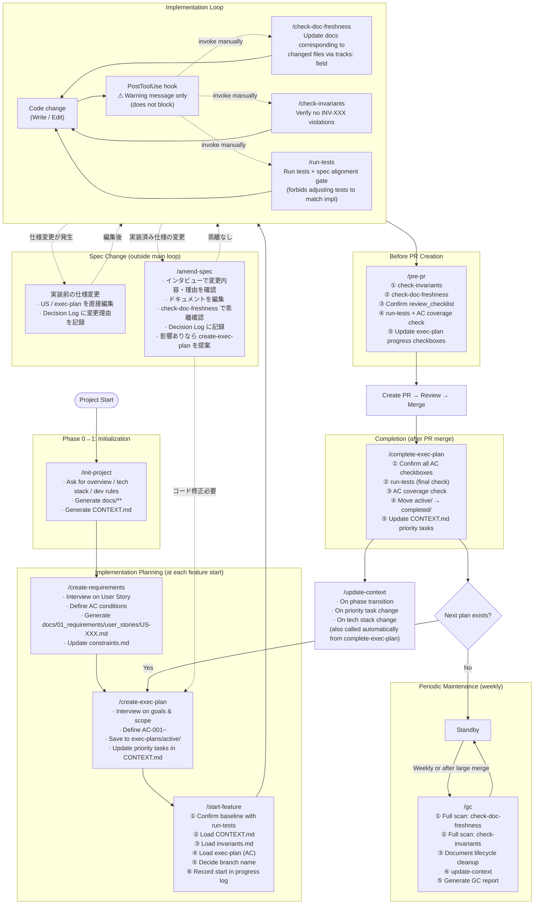
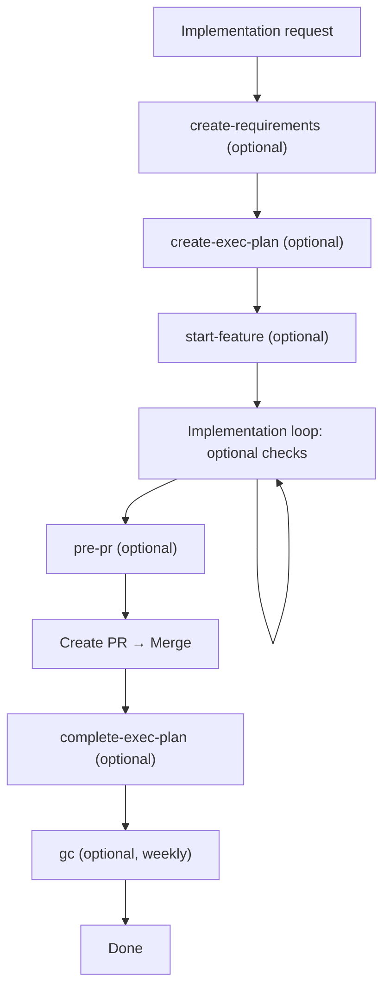

# DocDD Skill Operation Flow & Gap Analysis

## 1. Overall Flow

---

## 2. Skill Call Relationships

| Caller | Callee | Type |
|--------|--------|------|
| `create-requirements` | `create-exec-plan` | Handoff (suggests next step) |
| `pre-pr` | `check-invariants` | Internal call |
| `pre-pr` | `check-doc-freshness` | Internal call |
| `pre-pr` | `run-tests` | Internal call |
| `start-feature` | `run-tests` | Internal call |
| `complete-exec-plan` | `run-tests` | Internal call |
| `complete-exec-plan` | `update-context` | Internal call |
| `gc` | `check-doc-freshness` | Internal call (full scan) |
| `gc` | `check-invariants` | Internal call (full scan) |
| `gc` | `update-context` | Internal call |
| `PostToolUse` hook | —— | Warning message only (no skill call) |
| `amend-spec` | `check-doc-freshness` | Internal call (when code exists) |
| `amend-spec` | `create-exec-plan` | Handoff (suggests when code impact found) |

---

## 3. Gap List

### 3-0. Resolved Issues

| # | Issue | Resolution |
|---|-------|------------|
| G4 | `spec-gate.py` が `実装前`・`実装済` などを誤検知していた | `実装` パターンに否定先読み `(?!前\|済\|方針\|仕様\|計画)` を追加して修正 |
| G5 | 仕様変更フローが未定義だった | CLAUDE.md にフロー分岐を明記・`/amend-spec` スキルを追加 |

### 3-1. Structural Hook Issues (Most Critical)

> **Note**: As of the current implementation, both `PostToolUse` and `UserPromptSubmit` hooks are configured in `.claude/settings.json` using Python (`python3`). G1 and G3 from the original analysis are resolved; the remaining hook concern is G2.

| # | Issue | Impact | Severity |
|---|-------|--------|----------|
| G1 | ~~`PostToolUse` hook specifies `shell: "powershell"`, non-functional on Linux/Mac~~ **Resolved** — hooks now use `python3` commands | — | ✅ Resolved |
| G2 | **Hook only displays a warning message and does not block** | Developer can ignore the warning and continue implementing | 🟡 Medium |
| G3 | ~~`UserPromptSubmit` hook does not exist~~ **Resolved** — `spec-gate.py` is already configured | — | ✅ Resolved |

### 3-2. Bypasses Before Implementation Starts

| # | Bypass | Result | Severity |
|---|--------|--------|----------|
| B1 | Issue "implement this" without running `create-exec-plan` | Implementation starts with no AC / undefined spec | 🔴 Critical |
| B2 | Begin implementation without running `start-feature` | Baseline tests unchecked; CONTEXT.md / invariants.md unread | 🟠 High |
| B3 | exec-plan exists but implementation is instructed while skipping `start-feature` steps | Step 0 (baseline check) is skipped; pre-existing failing tests go unnoticed | 🟠 High |

### 3-3. Bypasses During Implementation

| # | Bypass | Result | Severity |
|---|--------|--------|----------|
| B4 | Ignore hook warning after code change | Proceeds to next implementation without verifying docs | 🟡 Medium |
| B5 | Skip manual call to `check-doc-freshness` | Doc/impl drift accumulates silently | 🟡 Medium |
| B6 | Skip manual call to `check-invariants` | INV violations go undetected until just before PR | 🟡 Medium |
| B7 | Fix failing tests without going through the spec alignment gate | Test changes without spec justification occur (INV-T01 violation) | 🟠 High |

### 3-4. Bypasses Before PR

| # | Bypass | Result | Severity |
|---|--------|--------|----------|
| B8 | **Create PR without running `pre-pr`** | All checks skipped: invariants, doc-freshness, review_checklist, tests, AC coverage | 🔴 Critical |
| B9 | Create PR despite ❌ in `pre-pr` results | Quality gate becomes meaningless | 🟠 High |

### 3-5. Bypasses in Completion

| # | Bypass | Result | Severity |
|---|--------|--------|----------|
| B10 | Do not run `complete-exec-plan` after PR merge | Zombie plans remain in `exec-plans/active/`; CONTEXT.md goes stale | 🟡 Medium |
| B11 | Skip weekly `gc` runs | Drift accumulates, increasing future correction cost | 🟡 Medium |

---

## 4. Mandatory Gates vs. Optional Gates in the Flow

**Mandatory gates (impossible to skip): currently zero.**
All skills are manually invoked, and hooks do not block execution.

---

## 5. Improvement Proposals

### High Priority

| Improvement | Approach |
|-------------|----------|
| **Extend `spec-gate.py` to also check for `create-requirements`** | Currently `spec-gate.py` (UserPromptSubmit) checks for an exec-plan but not a User Story. Add a check for `docs/01_requirements/user_stories/` so that implementing without a US also triggers a warning |
| **Remind to run `pre-pr` before PR creation** | Add a `PostToolUse` hook that detects MCP calls like `mcp__github__create_pull_request` and warns if `pre-pr` has not been executed |

### Medium Priority

| Improvement | Approach |
|-------------|----------|
| **Change hook warnings to blocking** | Return `exit 1` from `post-tool-notify.py` to block Write/Edit and force user confirmation (use `exit 2` for a softer block if full blocking is too aggressive) |
| **`complete-exec-plan` reminder** | Prompt users to run `complete-exec-plan` via a post-merge hook or message |
