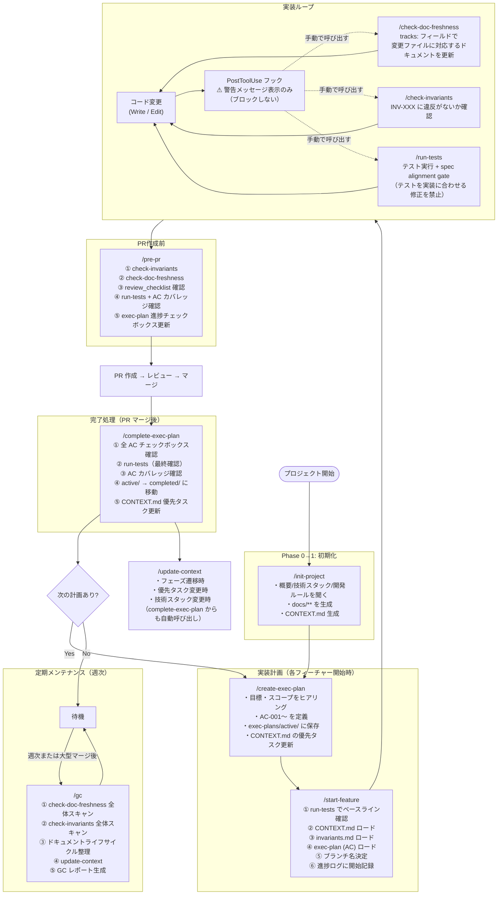

# DocDD スキル動作フロー・抜け穴分析

## 1. 全体フロー



---

## 2. スキル呼び出し関係

| 呼び出し元 | 呼び出し先 | 種別 |
|-----------|-----------|------|
| `pre-pr` | `check-invariants` | 内部呼び出し |
| `pre-pr` | `check-doc-freshness` | 内部呼び出し |
| `pre-pr` | `run-tests` | 内部呼び出し |
| `start-feature` | `run-tests` | 内部呼び出し |
| `complete-exec-plan` | `run-tests` | 内部呼び出し |
| `complete-exec-plan` | `update-context` | 内部呼び出し |
| `gc` | `check-doc-freshness` | 内部呼び出し（全体スキャン） |
| `gc` | `check-invariants` | 内部呼び出し（全体スキャン） |
| `gc` | `update-context` | 内部呼び出し |
| `PostToolUse` hook | ―― | 警告メッセージのみ（スキル呼び出しなし） |

---

## 3. 抜け穴一覧

### 3-1. フックの構造的問題（最重要）

| # | 問題 | 影響範囲 | 深刻度 |
|---|------|---------|--------|
| G1 | **`PostToolUse` フックが `shell: "powershell"` を指定しており、Linux/Mac 環境では動作しない** | 全コード変更後の警告が無効化される | 🔴 Critical |
| G2 | **フックは警告メッセージを表示するのみでブロックしない** | 警告を無視してそのまま実装継続が可能 | 🟡 Medium |
| G3 | **`UserPromptSubmit` フックが存在しない** | 「実装して」という指示が来ても自動で仕様確認がトリガーされない | 🟠 High |

### 3-2. 実装開始前のバイパス

| # | バイパス方法 | 結果 | 深刻度 |
|---|------------|------|--------|
| B1 | `create-exec-plan` を実行せず直接「実装して」と指示する | AC なし・仕様未定義のまま実装開始 | 🔴 Critical |
| B2 | `start-feature` を実行せず実装を始める | ベースラインテスト未確認・CONTEXT.md/invariants.md 未読 | 🟠 High |
| B3 | exec-plan はあるが `start-feature` のステップを省略して実装指示 | Step 0（ベースライン確認）がスキップされ、既存の失敗テストが見えない | 🟠 High |

### 3-3. 実装中のバイパス

| # | バイパス方法 | 結果 | 深刻度 |
|---|------------|------|--------|
| B4 | コード変更後にフック警告を無視する | ドキュメント確認なしで次の実装に進む | 🟡 Medium |
| B5 | `check-doc-freshness` を手動で呼ばない | ドキュメントと実装が乖離したまま蓄積される | 🟡 Medium |
| B6 | `check-invariants` を手動で呼ばない | INV 違反が PR 直前まで検知されない | 🟡 Medium |
| B7 | テスト失敗時に spec alignment gate を通さずテストを修正する | 仕様根拠なしのテスト修正（INV-T01 違反）が起きる | 🟠 High |

### 3-4. PR 前のバイパス

| # | バイパス方法 | 結果 | 深刻度 |
|---|------------|------|--------|
| B8 | **`pre-pr` を実行せず PR を作成する** | invariants・doc-freshness・review_checklist・テスト・AC カバレッジの全チェックをスキップ | 🔴 Critical |
| B9 | `pre-pr` の結果に ❌ があっても PR を作成する | 品質ゲートが形骸化する | 🟠 High |

### 3-5. 完了処理のバイパス

| # | バイパス方法 | 結果 | 深刻度 |
|---|------------|------|--------|
| B10 | PR マージ後に `complete-exec-plan` を実行しない | `exec-plans/active/` にゾンビプランが残り・CONTEXT.md が古くなる | 🟡 Medium |
| B11 | `gc` を週次で実行しない | ドリフトが蓄積し後から修正コストが増大 | 🟡 Medium |

---

## 4. フロー上の強制ゲートと任意ゲート

```
実装要求
    │
    ▼
【任意】create-exec-plan  ← ここをスキップすると AC なしで実装開始
    │
    ▼
【任意】start-feature     ← ここをスキップするとドキュメント未読・ベースライン未確認
    │
    ▼
実装ループ
    ├─ 【任意・フック警告のみ】check-doc-freshness
    ├─ 【任意】check-invariants
    └─ 【任意】run-tests
    │
    ▼
【任意】pre-pr            ← ここをスキップすると全品質ゲートが無効
    │
    ▼
PR 作成 → マージ
    │
    ▼
【任意】complete-exec-plan ← ここをスキップすると CONTEXT.md が古くなる
    │
    ▼
【任意・週次】gc
```

**強制ゲート（スキップ不可能な仕組み）: 現状ゼロ**
すべてのスキルが手動呼び出しであり、フックはブロッキングしない。

---

## 5. 改善案

### 優先度高

| 改善 | 方法 |
|------|------|
| **フックを bash に対応させる** | `settings.json` の `shell: "powershell"` を `shell: "bash"` に変更し、PowerShell 構文をシェルスクリプトに書き直す |
| **実装指示への自動反応** | `UserPromptSubmit` フックで「実装・作成・追加・修正」等のキーワードを検知し、exec-plan の有無を確認するメッセージを出す |
| **`pre-pr` の実行を PR 作成前にリマインド** | `PostToolUse` フックで `mcp__github__create_pull_request` 等を検知し、`pre-pr` 実行済みかを問い合わせる |

### 優先度中

| 改善 | 方法 |
|------|------|
| **フック警告をブロッキングに変更** | `exit 1` を返すことで Write/Edit をブロックし、ユーザーに確認を強制する（強すぎる場合は `exit 2` でソフトブロック） |
| **`complete-exec-plan` リマインド** | PR マージ後のフックまたはメッセージで `complete-exec-plan` の実行を促す |
