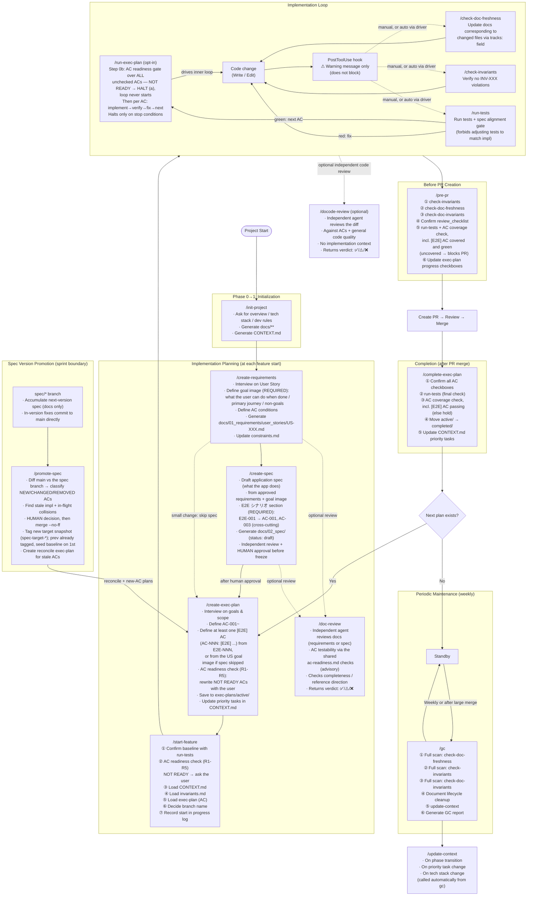
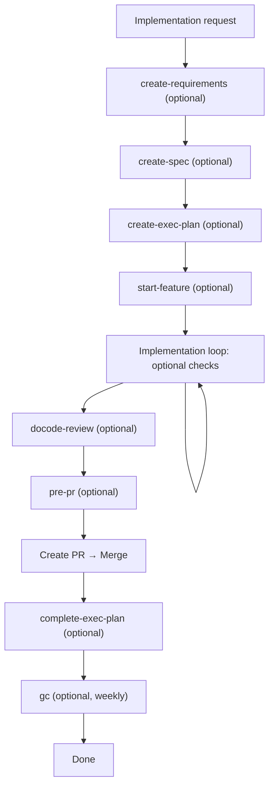

# DocDD Skill Operation Flow & Gap Analysis

> **Human-perspective flow & responsibility split** (the two-layer split of skills the human invokes
> vs. skills the AI runs internally) is documented in
> [`ONBOARDING.md` §6-0](ONBOARDING.md#6-0-what-the-human-does-responsibility-split)
> (日本語: [`ONBOARDING.ja.md` §6-0](ONBOARDING.ja.md#6-0-人が何をするか責任分担)).
> This document covers the detailed flow including all skill dependencies.

## 1. Overall Flow

```mermaid
flowchart TD
    START([Project Start]) --> INIT

    subgraph PHASE01["Phase 0→1: Initialization"]
        INIT["/init-project\n· Ask for overview / tech stack / dev rules\n· Generate docs/**\n· Generate CONTEXT.md"]
    end

    INIT --> REQ

    subgraph PLAN_PHASE["Implementation Planning (at each feature start)"]
        REQ["/create-requirements\n· Interview on User Story\n· Define goal image (REQUIRED):\n  what the user can do when done /\n  primary journey / non-goals\n· Define AC conditions\n· Generate docs/01_requirements/user_stories/US-XXX.md\n· Update constraints.md"]
        REQ -.->|optional review| DR
        DR["/doc-review\n· Independent agent reviews docs (requirements or spec)\n· AC testability via the shared\n  ac-readiness.md checks (advisory)\n· Checks completeness / reference direction\n· Returns verdict: ✅/⚠️/❌"]
        SPEC["/create-spec\n· Draft application spec (what the app does)\n· from approved requirements + goal image\n· E2E シナリオ section (REQUIRED):\n  E2E-001 → AC-001, AC-003 (cross-cutting)\n· Generate docs/02_spec/ (status: draft)\n· Independent review + HUMAN approval before freeze"]
        REQ --> SPEC
        SPEC -.->|optional review| DR
        SPEC -->|after human approval| PLAN
        REQ -.->|small change: skip spec| PLAN
        PLAN["/create-exec-plan\n· Interview on goals & scope\n· Define AC-001~\n· Define at least one [E2E] AC\n  (AC-NNN: [E2E] ...) from E2E-NNN,\n  or from the US goal image if spec skipped\n· AC readiness check (R1-R5):\n  rewrite NOT READY ACs with the user\n· Save to exec-plans/active/\n· Update priority tasks in CONTEXT.md"]
        PLAN --> SF
        SF["/start-feature\n① Confirm baseline with run-tests\n② AC readiness check (R1-R5)\n   NOT READY → ask the user\n③ Load CONTEXT.md\n④ Load invariants.md\n⑤ Load exec-plan (AC)\n⑥ Decide branch name\n⑦ Record start in progress log"]
    end

    SF --> IMPL

    subgraph IMPL["Implementation Loop"]
        DRIVER["/run-exec-plan (opt-in)\nStep 0b: AC readiness gate over ALL\nunchecked ACs — NOT READY → HALT (a),\nloop never starts\nThen per AC: implement→verify→fix→next\nHalts only on stop conditions"]
        CODE["Code change\n(Write / Edit)"]
        HOOK["PostToolUse hook\n⚠ Warning message only\n(does not block)"]
        CDF["/check-doc-freshness\nUpdate docs corresponding to\nchanged files via tracks: field"]
        CI["/check-invariants\nVerify no INV-XXX violations"]
        RT["/run-tests\nRun tests + spec alignment gate\n(forbids adjusting tests to match impl)"]

        DRIVER -->|drives inner loop| CODE
        CODE --> HOOK
        HOOK -.->|manual, or auto via driver| CDF
        HOOK -.->|manual, or auto via driver| CI
        HOOK -.->|manual, or auto via driver| RT
        CDF --> CODE
        CI --> CODE
        RT -->|green: next AC| DRIVER
        RT -->|red: fix| CODE
    end

    IMPL --> PREPR
    IMPL -.->|optional independent code review| DCR
    DCR["/docode-review (optional)\n· Independent agent reviews the diff\n· Against ACs + general code quality\n· No implementation context\n· Returns verdict: ✅/⚠️/❌"]

    subgraph PREPR_PHASE["Before PR Creation"]
        PREPR["/pre-pr\n① check-invariants\n② check-doc-freshness\n③ check-doc-invariants\n④ Confirm review_checklist\n⑤ run-tests + AC coverage check,\n   incl. [E2E] AC covered and green\n   (uncovered → blocks PR)\n⑥ Update exec-plan progress checkboxes"]
    end

    PREPR --> PR
    PR["Create PR → Review → Merge"]
    PR --> COMPLETE

    subgraph COMPLETE_PHASE["Completion (after PR merge)"]
        COMPLETE["/complete-exec-plan\n① Confirm all AC checkboxes\n② run-tests (final check)\n③ AC coverage check,\n   incl. [E2E] AC passing (else hold)\n④ Move active/ → completed/\n⑤ Update CONTEXT.md priority tasks"]
    end

    COMPLETE --> NEXT
    NEXT{Next plan exists?}
    NEXT -->|Yes| PLAN
    NEXT -->|No| GC_WAIT

    subgraph GC_PHASE["Periodic Maintenance (weekly)"]
        GC_WAIT["Standby"]
        GC["/gc\n① Full scan: check-doc-freshness\n② Full scan: check-invariants\n③ Full scan: check-doc-invariants\n④ Document lifecycle cleanup\n⑤ update-context\n⑥ Generate GC report"]
        GC_WAIT -->|Weekly or after large merge| GC
        GC --> GC_WAIT
    end

    subgraph SPEC_PROMO["Spec Version Promotion (sprint boundary)"]
        SPECBR["spec/* branch\n· Accumulate next-version spec (docs only)\n· In-version fixes commit to main directly"]
        PROMO["/promote-spec\n· Diff main vs the spec branch → classify NEW/CHANGED/REMOVED ACs\n· Find stale impl + in-flight collisions\n· HUMAN decision, then merge --no-ff\n· Tag new target snapshot (spec-target-*); prev already tagged, seed baseline on 1st\n· Create reconcile exec-plan for stale ACs"]
        SPECBR --> PROMO
    end

    PROMO -->|reconcile + new-AC plans| PLAN

    UC["/update-context\n· On phase transition\n· On priority task change\n· On tech stack change\n(called automatically from gc)"]
    GC --> UC
```

> **Note**: `complete-exec-plan` updates `CONTEXT.md` **directly** in its own Step 4; it does not invoke the `update-context` skill. Only `gc` calls `update-context` internally.

---

## 2. Skill Call Relationships

| Caller | Callee | Type |
|--------|--------|------|
| `create-requirements` | `create-spec` | Handoff (suggests next step) |
| `create-requirements` | `doc-review` | Optional handoff (user-triggered) |
| `create-spec` | `doc-review` | Handoff (suggests independent review of the spec) |
| `create-spec` | `create-exec-plan` | Handoff (after human approval of the spec) |
| `pre-pr` | `check-invariants` | Internal call |
| `pre-pr` | `check-doc-freshness` | Internal call |
| `pre-pr` | `check-doc-invariants` | Internal call |
| `pre-pr` | `run-tests` | Internal call |
| `start-feature` | `run-tests` | Internal call |
| `run-exec-plan` | `run-tests` | Internal call (per AC, via Skill tool — `run-tests` is model-invocable) |
| `run-exec-plan` | `check-invariants` | Internal call (per AC, inline) |
| `run-exec-plan` | `check-doc-freshness` | Internal call (advisory) |
| `complete-exec-plan` | `run-tests` | Internal call |
| `complete-exec-plan` | —— | Updates `CONTEXT.md` directly (does not call `update-context`) |
| `gc` | `check-doc-freshness` | Internal call (full scan) |
| `gc` | `check-invariants` | Internal call (full scan) |
| `gc` | `check-doc-invariants` | Internal call (full scan) |
| `gc` | `update-context` | Internal call |
| `promote-spec` | `create-exec-plan` | Handoff (suggests new-AC plans after promotion) |
| `promote-spec` | `start-feature` | Handoff (reconcile exec-plan → begin reconciliation) |
| —— (human-invoked, optional) | `docode-review` | Standalone independent code review before `pre-pr` — spawns a subagent via the Agent tool (no internal caller) |
| `PostToolUse` hook | —— | Warning message only (no skill call) |

> **Shared reference file (not a skill):** `create-exec-plan` (Q3c), `start-feature` (Step 1b),
> `run-exec-plan` (Step 0b) and `doc-review` (§2) all apply
> [`.claude/skills/create-exec-plan/ac-readiness.md`](.claude/skills/create-exec-plan/ac-readiness.md)
> — the AC readiness (testability) checks R1–R5. It is read, not invoked; the criteria are identical
> at the four sites and only the action on NOT READY differs (rewrite with the user / ask the user /
> HALT / advisory). `doc-review` embeds the file's content in the subagent prompt, since an
> independent agent has no session context to inherit it from.

> **Invocation mode:** Among the callees above, `run-tests` is model-invocable
> (`disable-model-invocation: false`), so its callers invoke it via the Skill tool; the other
> *internal-call* callees keep `disable-model-invocation: true` and are executed inline by following
> their `SKILL.md` steps (the Skill tool is not exposed for them). `docode-review` is also
> model-invocable (`false`) — it spawns an independent subagent via the Agent tool — but unlike
> `run-tests` it has no internal caller: the human invokes it directly. See CLAUDE.md "検証スキルの呼び出しポリシー".

---

## 3. Gap List

### 3-1. Structural Hook Issues (Most Critical)

> **Note**: As of the current implementation, both `PostToolUse` and `UserPromptSubmit` hooks are configured in `.claude/settings.json` using Python (`python3`). G1 and G3 from the original analysis are resolved; the remaining hook concern is G2.

| # | Issue | Impact | Severity |
|---|-------|--------|----------|
| G1 | ~~`PostToolUse` hook specifies `shell: "powershell"`, non-functional on Linux/Mac~~ **Resolved** — hooks now use `python3` commands | — | ✅ Resolved |
| G2 | **Hook only displays a warning message and does not block** | Developer can ignore the warning and continue implementing | 🟡 Medium |
| G3 | ~~`UserPromptSubmit` hook does not exist~~ **Resolved** — `spec-gate.py` is already configured | — | ✅ Resolved |

### 3-2. Bypasses Before Implementation Starts

| # | Bypass | Result | Severity |
|---|--------|--------|----------|
| B1 | Issue "implement this" without running `create-exec-plan` | Implementation starts with no AC / undefined spec | 🔴 Critical |
| B2 | Begin implementation without running `start-feature` | Baseline tests unchecked; CONTEXT.md / invariants.md unread | 🟠 High |
| B3 | exec-plan exists but implementation is instructed while skipping `start-feature` steps | Step 0 (baseline check) is skipped; pre-existing failing tests go unnoticed | 🟠 High |

### 3-3. Bypasses During Implementation

| # | Bypass | Result | Severity |
|---|--------|--------|----------|
| B4 | Ignore hook warning after code change | Proceeds to next implementation without verifying docs | 🟡 Medium |
| B5 | Skip manual call to `check-doc-freshness` | Doc/impl drift accumulates silently | 🟡 Medium |
| B6 | Skip manual call to `check-invariants` | INV violations go undetected until just before PR | 🟡 Medium |
| B7 | Fix failing tests without going through the spec alignment gate | Test changes without spec justification occur (INV-T01 violation) | 🟠 High |

> **Inner-loop automation (issue #11)**: The bypasses above stem partly from the implementation
> loop being a *manual chain* (code → manually invoke CDF/CI/RT). `/run-exec-plan` provides an
> **opt-in autonomous inner loop** that, within a frozen AC set, runs implement → run-tests →
> check-invariants → advance without per-step confirmation, while still halting at the
> **outer gates** (B7's spec alignment gate, irreversible actions, ambiguous AC). It automates
> *execution*, not *governance* — see "自律実装ループ" in CLAUDE.md for the stop conditions.

### 3-4. Bypasses Before PR

| # | Bypass | Result | Severity |
|---|--------|--------|----------|
| B8 | **Create PR without running `pre-pr`** | All checks skipped: invariants, doc-freshness, review_checklist, tests, AC coverage | 🔴 Critical |
| B9 | Create PR despite ❌ in `pre-pr` results | Quality gate becomes meaningless | 🟠 High |

### 3-5. Bypasses in Completion

| # | Bypass | Result | Severity |
|---|--------|--------|----------|
| B10 | Do not run `complete-exec-plan` after PR merge | Zombie plans remain in `exec-plans/active/`; CONTEXT.md goes stale | 🟡 Medium |
| B11 | Skip weekly `gc` runs | Drift accumulates, increasing future correction cost | 🟡 Medium |

### 3-6. Goal Quality (a different axis from bypasses)

B1–B11 above are about **skipping gates**. There is a second axis: passing every gate while the
goal itself is too thin to steer autonomous implementation toward. That axis is tracked in issue
#28 (G-A … G-F) rather than here; the items already addressed in the flow above are recorded for
context (an issue closes on merge, not on this table):

| # | Issue | Status |
|---|-------|--------|
| G-F | No layer defined the finished picture, so a spec could satisfy every requirement and still be the wrong thing; and per-AC greens never proved the through-flow | ✅ Resolved (#27, merged) — `create-requirements` goal image (required) → `create-spec` `## E2E シナリオ` (required, `E2E-NNN → AC-xxx`) → `create-exec-plan` `[E2E]` AC → `run-tests` / `pre-pr` / `complete-exec-plan` E2E coverage gate |
| G-C | AC testability was only judged **inside** the loop, subjectively, after implementation had begun | 🔄 Addressed, pending merge of #24 — shared `ac-readiness.md` (R1–R5) applied at `create-exec-plan` Q3c / `start-feature` Step 1b / `run-exec-plan` Step 0b (NOT READY → loop never starts) / `doc-review` §2 |
| G-A / G-B / G-D / G-E | Red-first acceptance tests, goal reaching the driver intact, spec re-anchoring, mandatory final goal review | Open — see #28 |

---

## 4. Mandatory Gates vs. Optional Gates in the Flow

```mermaid
flowchart TD
  A[Implementation request] --> R["create-requirements (optional)"]
  R --> S["create-spec (optional)"]
  S --> B["create-exec-plan (optional)"]
  B --> C["start-feature (optional)"]

  C --> L[Implementation loop: optional checks]
  L --> L

  L --> DCR["docode-review (optional)"]
  DCR --> P["pre-pr (optional)"]
  P --> M[Create PR → Merge]
  M --> Q["complete-exec-plan (optional)"]
  Q --> G["gc (optional, weekly)"]
  G --> Z[Done]
```

**Mandatory gates (impossible to skip): currently zero.**
All skills are manually invoked, and hooks do not block execution.

> **Blocking *within* a skill is a different thing.** Once `pre-pr` or `complete-exec-plan` is
> actually run, an uncovered or failing `[E2E]` AC blocks PR creation / completion — it cannot be
> waved through the way an advisory warning can. The same holds for AC readiness inside
> `run-exec-plan`: a NOT READY criterion stops the loop from starting at all. That does not make the
> skills themselves unskippable; it means those checks are not optional for anyone who runs the gate.
>
> Readiness is also the one check deliberately applied at **three** points on the path
> (`create-exec-plan` → `start-feature` → `run-exec-plan`), because each is the last moment before a
> different kind of cost: writing the plan, writing code by hand, and handing the plan to an
> unattended loop.

> **Spec version promotion** (`/promote-spec`) is a separate, human-gated event that runs at sprint
> boundaries rather than on the linear path above. It merges a `spec/*` branch into `main`, tags the
> outgoing version (`spec-target-*`), and feeds reconcile / new-AC plans back into the planning phase.
> The merge is a deliberate human decision; the skill only assists analysis before and bookkeeping after.

---

## 5. Improvement Proposals

### High Priority

| Improvement | Approach |
|-------------|----------|
| **Extend `spec-gate.py` to also check for `create-requirements`** | Currently `spec-gate.py` (UserPromptSubmit) checks for an exec-plan but not a User Story. Add a check for `docs/01_requirements/user_stories/` so that implementing without a US also triggers a warning |
| **Remind to run `pre-pr` before PR creation** | Add a `PostToolUse` hook that detects MCP calls like `mcp__github__create_pull_request` and warns if `pre-pr` has not been executed |

### Medium Priority

| Improvement | Approach |
|-------------|----------|
| **Change hook warnings to blocking** | Return `exit 1` from `post-tool-notify.py` to block Write/Edit and force user confirmation (use `exit 2` for a softer block if full blocking is too aggressive) |
| **`complete-exec-plan` reminder** | Prompt users to run `complete-exec-plan` via a post-merge hook or message |
