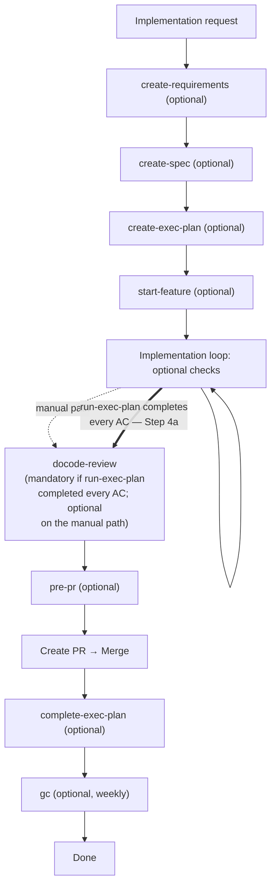

# DocDD Skill Operation Flow & Gap Analysis

> **Human-perspective flow & responsibility split** (the two-layer split of skills the human invokes
> vs. skills the AI runs internally) is documented in
> [`ONBOARDING.md` §6-0](ONBOARDING.md#6-0-what-the-human-does-responsibility-split)
> (日本語: [`ONBOARDING.ja.md` §6-0](ONBOARDING.ja.md#6-0-人が何をするか責任分担)).
> This document covers the detailed flow including all skill dependencies.

## 1. Overall Flow

```mermaid
flowchart TD
    START([Project Start]) --> INIT

    subgraph PHASE01["Phase 0→1: Initialization"]
        INIT["/init-project\n· Ask for overview / tech stack / dev rules\n· Generate docs/**\n· Generate CONTEXT.md"]
    end

    INIT --> REQ

    subgraph PLAN_PHASE["Implementation Planning (at each feature start)"]
        REQ["/create-requirements\n· Interview on User Story\n· Define goal image (REQUIRED):\n  what the user can do when done /\n  primary journey / non-goals\n· Define AC conditions\n· Generate docs/01_requirements/user_stories/US-XXX.md\n· Update constraints.md"]
        REQ -.->|optional review| DR
        DR["/doc-review\n· Independent agent reviews docs (requirements or spec)\n· AC testability via the shared\n  ac-readiness.md checks (advisory)\n· Process docs: walks 2nd-lap / resume /\n  exemption / dependency backflow\n  (process-walkthrough.md)\n· Checks completeness / reference direction\n· Returns verdict: ✅/⚠️/❌"]
        SPEC["/create-spec\n· Draft application spec (what the app does)\n· from approved requirements + goal image\n· E2E シナリオ section (REQUIRED):\n  E2E-001 → AC-001, AC-003 (cross-cutting)\n· Generate docs/02_spec/ (status: draft)\n· Independent review + HUMAN approval before freeze"]
        REQ --> SPEC
        SPEC -.->|optional review| DR
        SPEC -->|after human approval| PLAN
        REQ -.->|small change: skip spec| PLAN
        PLAN["/create-exec-plan\n· Interview on goals & scope\n· Process-changing plan: require a\n  walkthrough AC (laps, not description matching)\n· Define AC-001~\n· Define at least one [E2E] AC\n  (AC-NNN: [E2E] ...) from E2E-NNN,\n  or from the US goal image if spec skipped\n· documentation-only plan: no [E2E] AC —\n  record E2E: n/a in the Decision Log\n· ## Sources: per-AC pointer to the US bullets\n  and spec section it condenses (n/a with a reason)\n· AC readiness check (R1-R5):\n  rewrite NOT READY ACs with the user\n· Save to exec-plans/active/\n· Update priority tasks in CONTEXT.md"]
        PLAN --> SF
        SF["/start-feature\n① Confirm baseline with run-tests\n② Select the exec-plan (AC)\n③ AC readiness check (R1-R5)\n   NOT READY → ask the user\n④ Load CONTEXT.md\n⑤ Load invariants.md + the US/spec\n   sections in ## Sources\n⑥ Decide branch name\n⑦ Record start in progress log\n⑧ Implementation order: red-first,\n   then stable layer first"]
    end

    SF --> IMPL

    subgraph IMPL["Implementation Loop"]
        DRIVER["/run-exec-plan (opt-in)\nStep 0b: AC readiness gate over ALL\nunchecked ACs — NOT READY → HALT (a),\nloop never starts\nStep 0c: place each [E2E] test RED\nbefore any AC is implemented\nThen per AC: read sources→red test→implement\n→verify→re-anchor→next\nStep 4a: once every AC is - [x], run\ndocode-review — MANDATORY here.\n❌ → HALT (f); ✅/⚠️ → hand off\nHalts only on stop conditions"]
        SOURCES["Step 1b: read the AC's sources\n· the US bullets + spec section\n  named in the plan's ## Sources\n· NOT the implementation code\n· separate outcome / contradiction → HALT (a)"]
        REDFIRST["Write the failing test\n(red-first / INV-T02)\n· transcribe given/when/then from\n  the AC line AND its sources\n· run it: valid red required\n· record the red → expectation frozen\n· cannot transcribe → HALT (a)"]
        REANCHOR["Step 3a: spec re-anchor\n· does the implemented behavior do what\n  the AC's spec section describes?\n· impl gap → fix | test gap → new red-first test\n· spec contradicts the AC → HALT (a)\n· record it on the AC-NNN done line"]
        CODE["Code change\n(Write / Edit)"]
        HOOK["PostToolUse hook\n⚠ Warning message only\n(does not block)"]
        CDF["/check-doc-freshness\nUpdate docs corresponding to\nchanged files via tracks: field"]
        CI["/check-invariants\nVerify no INV-XXX violations"]
        RT["/run-tests\nRun tests + spec alignment gate\n(forbids adjusting tests to match impl)\nred-first run: classify valid vs invalid red"]

        DRIVER -->|drives inner loop| SOURCES
        SOURCES -->|goal received in full| REDFIRST
        REDFIRST -->|valid red observed| CODE
        CODE --> HOOK
        HOOK -.->|manual, or auto via driver| CDF
        HOOK -.->|manual, or auto via driver| CI
        HOOK -.->|manual, or auto via driver| RT
        CDF --> CODE
        CI --> CODE
        RT -->|green| REANCHOR
        RT -->|red: fix| CODE
        REANCHOR -->|一致: check the box, next AC| DRIVER
        REANCHOR -->|gap vs. the spec section| CODE
    end

    IMPL --> PREPR
    IMPL -.->|optional, manual path\n(no run-exec-plan)| DCR
    DRIVER ==>|mandatory once every AC is - [x]\n(Step 4a)| DCR
    DCR["/docode-review\n(mandatory on autonomous completion,\noptional on the manual path)\n· Independent agent reviews the diff\n· Against ACs AND the US/spec sections\n  in the plan's ## Sources\n· Tests vs ACs (independence)\n· Process diffs: walks the laps, incl.\n  dependency backflow (call-site table,\n  then grep — the sites the diff did NOT\n  touch are the point)\n· No implementation context\n· Returns verdict: ✅/⚠️/❌\n· ❌ from Step 4a → HALT (f)"]

    subgraph PREPR_PHASE["Before PR Creation"]
        PREPR["/pre-pr\n① check-invariants\n② check-doc-freshness\n③ check-doc-invariants\n④ Confirm review_checklist\n⑤ run-tests + AC coverage check,\n   incl. [E2E] AC covered and green\n   (uncovered → blocks PR)\n   + red-first evidence per AC (⚠️ only)\n⑤b process-walkthrough evidence (⚠️ only)\n⑤c ## Sources + spec re-anchor record (⚠️ only)\n⑤d docode-review verdict recorded?\n   for autonomous completions (⚠️ only)\n⑥ Update exec-plan progress checkboxes"]
    end

    PREPR --> PR
    PR["Create PR → Review → Merge"]
    PR --> COMPLETE

    subgraph COMPLETE_PHASE["Completion (after PR merge)"]
        COMPLETE["/complete-exec-plan\n① Confirm all AC checkboxes\n② run-tests (final check)\n③ AC coverage check,\n   incl. [E2E] AC passing (else hold)\n   + red-first evidence (⚠️ only)\n④ Move active/ → completed/\n⑤ Update CONTEXT.md priority tasks"]
    end

    COMPLETE --> NEXT
    NEXT{Next plan exists?}
    NEXT -->|Yes| PLAN
    NEXT -->|No| GC_WAIT

    subgraph GC_PHASE["Periodic Maintenance (weekly)"]
        GC_WAIT["Standby"]
        GC["/gc\n① Full scan: check-doc-freshness\n② Full scan: check-invariants\n③ Full scan: check-doc-invariants\n④ Document lifecycle cleanup\n⑤ update-context\n⑥ Generate GC report"]
        GC_WAIT -->|Weekly or after large merge| GC
        GC --> GC_WAIT
    end

    subgraph SPEC_PROMO["Spec Version Promotion (sprint boundary)"]
        SPECBR["spec/* branch\n· Accumulate next-version spec (docs only)\n· In-version fixes commit to main directly"]
        PROMO["/promote-spec\n· Diff main vs the spec branch → classify NEW/CHANGED/REMOVED ACs\n· Find stale impl + in-flight collisions\n· HUMAN decision, then merge --no-ff\n· Tag new target snapshot (spec-target-*); prev already tagged, seed baseline on 1st\n· Create reconcile exec-plan for stale ACs\n  (carries an [E2E] AC; re-opened ACs are\n  re-tested red-first against the new spec)"]
        SPECBR --> PROMO
    end

    PROMO -->|reconcile + new-AC plans| PLAN

    UC["/update-context\n· On phase transition\n· On priority task change\n· On tech stack change\n(called automatically from gc)"]
    GC --> UC
```

> **Note**: `complete-exec-plan` updates `CONTEXT.md` **directly** in its own Step 4; it does not invoke the `update-context` skill. Only `gc` calls `update-context` internally.

---

## 2. Skill Call Relationships

| Caller | Callee | Type |
|--------|--------|------|
| `create-requirements` | `create-spec` | Handoff (suggests next step) |
| `create-requirements` | `doc-review` | Optional handoff (user-triggered) |
| `create-spec` | `doc-review` | Handoff (suggests independent review of the spec) |
| `create-spec` | `create-exec-plan` | Handoff (after human approval of the spec) |
| `pre-pr` | `check-invariants` | Internal call |
| `pre-pr` | `check-doc-freshness` | Internal call |
| `pre-pr` | `check-doc-invariants` | Internal call |
| `pre-pr` | `run-tests` | Internal call |
| `start-feature` | `run-tests` | Internal call |
| `run-exec-plan` | `run-tests` | Internal call (per AC — once for the red-first run before implementing, once to verify; via Skill tool, `run-tests` is model-invocable) |
| `run-exec-plan` | `docs/01_requirements/` + `docs/02_spec/` | Not a skill call — Step 1b **reads** the sections the plan's `## Sources` names, and Step 3a re-reads the spec section before checking the box |
| `run-exec-plan` | `check-invariants` | Internal call (per AC, inline) |
| `run-exec-plan` | `check-doc-freshness` | Internal call (advisory) |
| `complete-exec-plan` | `run-tests` | Internal call |
| `complete-exec-plan` | —— | Updates `CONTEXT.md` directly (does not call `update-context`) |
| `gc` | `check-doc-freshness` | Internal call (full scan) |
| `gc` | `check-invariants` | Internal call (full scan) |
| `gc` | `check-doc-invariants` | Internal call (full scan) |
| `gc` | `update-context` | Internal call |
| `promote-spec` | `create-exec-plan` | Handoff (suggests new-AC plans after promotion) |
| `promote-spec` | `start-feature` | Handoff (reconcile exec-plan → begin reconciliation) |
| `run-exec-plan` | `docode-review` | Internal call, **mandatory** (Step 4a) — runs once every AC is `- [x]`, before handoff to `pre-pr`; a ❌ verdict halts with stop condition (f) instead of handing off |
| —— (human-invoked, optional) | `docode-review` | Standalone independent code review before `pre-pr`, on the manual (`start-feature`) path — spawns a subagent via the Agent tool (no internal caller on this path) |
| `PostToolUse` hook | —— | Warning message only (no skill call) |

> **Shared reference file (not a skill):**
> [`.claude/skills/create-exec-plan/process-walkthrough.md`](.claude/skills/create-exec-plan/process-walkthrough.md)
> — the laps to walk when a plan changes a **process** (a loop, a resumable run, a stop condition, a
> gate, an exemption, or a single source other rules consume). `create-exec-plan` (Q3e) requires the
> plan to carry a walkthrough AC, the implementer records the laps, `doc-review` (§2c) and
> `docode-review` walk them against the diff, and `pre-pr` (⑤b) checks the record exists (⚠️ only).
> It exists because comparing call-site descriptions cannot see a process that deadlocks: the
> descriptions agree and the states do not. The laps run in two directions — six forward through
> what the change added, and one (**dependency backflow**) inward from every existing site that
> consumes what changed, since a single-source edit alters those sites' input requirements without
> editing a character of them.
>
> **Shared reference file (not a skill):**
> [`.claude/skills/create-exec-plan/ac-sources.md`](.claude/skills/create-exec-plan/ac-sources.md)
> — the `## Sources` table an exec-plan carries (which US bullets and which spec section each
> one-line AC condenses), and the two moments it is read: **before** drafting the test
> (`run-exec-plan` Step 1b, `start-feature` Step 2) and **before** the AC's box is checked
> (`run-exec-plan` Step 3a — the spec re-anchor). `create-exec-plan` (Q3d) writes the table,
> `promote-spec` writes it for reconcile plans against the *new* spec, `pre-pr` (⑤c) reports a
> missing table or re-anchor record (⚠️ only), and `docode-review` judges the diff against the
> sources rather than the one-liner. It exists because the AC line is a condensation by design —
> `spec-gate.py` parses `AC-(\d{3}):`, so the verifiable detail stays in the US and the spec, and
> without a pointer it never reaches the implementer.
>
> **Shared reference file (not a skill):**
> [`.claude/skills/run-tests/red-first.md`](.claude/skills/run-tests/red-first.md) — the red-first
> procedure (INV-T02): write the test from the AC before its implementation, observe a **valid** red,
> record it (which freezes the expectation), then implement. `run-exec-plan` (Step 0c / Step 2a),
> `run-tests` (red-first run), `start-feature` (implementation order), `pre-pr` /
> `complete-exec-plan` (evidence check, ⚠️ only) and `docode-review` all reference it. The action on
> failure differs by site — HALT for the unattended loop, ask the human on the manual path, report
> only after the fact — for the same reason as readiness below: deciding an expected result the AC
> does not state is an outer-gate call.
>
> **Shared reference file (not a skill):** `create-exec-plan` (Q3c), `start-feature` (Step 1b),
> `run-exec-plan` (Step 0b) and `doc-review` (§2) all apply
> [`.claude/skills/create-exec-plan/ac-readiness.md`](.claude/skills/create-exec-plan/ac-readiness.md)
> — the AC readiness (testability) checks R1–R5. It is read, not invoked; the criteria are identical
> at the four sites and only the action on NOT READY differs (rewrite with the user / ask the user /
> HALT / advisory). `doc-review` embeds the file's content in the subagent prompt, since an
> independent agent has no session context to inherit it from.

> **Invocation mode:** Among the callees above, `run-tests` is model-invocable
> (`disable-model-invocation: false`), so its callers invoke it via the Skill tool; the other
> *internal-call* callees keep `disable-model-invocation: true` and are executed inline by following
> their `SKILL.md` steps (the Skill tool is not exposed for them). `docode-review` is also
> model-invocable (`false`) — it spawns an independent subagent via the Agent tool. Unlike the other
> *internal-call* callees, it now has **two** call paths: `run-exec-plan` Step 4a invokes it via the
> Skill tool as a **mandatory** internal call once every AC is `- [x]`, while on the manual
> (`start-feature`) path it still has no internal caller and the human invokes it directly.
> See CLAUDE.md "検証スキルの呼び出しポリシー".

---

## 3. Gap List

### 3-1. Structural Hook Issues (Most Critical)

> **Note**: As of the current implementation, both `PostToolUse` and `UserPromptSubmit` hooks are configured in `.claude/settings.json` using Python (`python3`). G1 and G3 from the original analysis are resolved; the remaining hook concern is G2.

| # | Issue | Impact | Severity |
|---|-------|--------|----------|
| G1 | ~~`PostToolUse` hook specifies `shell: "powershell"`, non-functional on Linux/Mac~~ **Resolved** — hooks now use `python3` commands | — | ✅ Resolved |
| G2 | **Hook only displays a warning message and does not block** | Developer can ignore the warning and continue implementing | 🟡 Medium |
| G3 | ~~`UserPromptSubmit` hook does not exist~~ **Resolved** — `spec-gate.py` is already configured | — | ✅ Resolved |

### 3-2. Bypasses Before Implementation Starts

| # | Bypass | Result | Severity |
|---|--------|--------|----------|
| B1 | Issue "implement this" without running `create-exec-plan` | Implementation starts with no AC / undefined spec | 🔴 Critical |
| B2 | Begin implementation without running `start-feature` | Baseline tests unchecked; CONTEXT.md / invariants.md unread | 🟠 High |
| B3 | exec-plan exists but implementation is instructed while skipping `start-feature` steps | Step 0 (baseline check) is skipped; pre-existing failing tests go unnoticed | 🟠 High |

### 3-3. Bypasses During Implementation

| # | Bypass | Result | Severity |
|---|--------|--------|----------|
| B4 | Ignore hook warning after code change | Proceeds to next implementation without verifying docs | 🟡 Medium |
| B5 | Skip manual call to `check-doc-freshness` | Doc/impl drift accumulates silently | 🟡 Medium |
| B6 | Skip manual call to `check-invariants` | INV violations go undetected until just before PR | 🟡 Medium |
| B7 | Fix failing tests without going through the spec alignment gate | Test changes without spec justification occur (INV-T01 violation) | 🟠 High |

> **Inner-loop automation (issue #11)**: The bypasses above stem partly from the implementation
> loop being a *manual chain* (code → manually invoke CDF/CI/RT). `/run-exec-plan` provides an
> **opt-in autonomous inner loop** that, within a frozen AC set, runs implement → run-tests →
> check-invariants → advance without per-step confirmation, while still halting at the
> **outer gates** (B7's spec alignment gate, irreversible actions, ambiguous AC). It automates
> *execution*, not *governance* — see "自律実装ループ" in CLAUDE.md for the stop conditions.

### 3-4. Bypasses Before PR

| # | Bypass | Result | Severity |
|---|--------|--------|----------|
| B8 | **Create PR without running `pre-pr`** | All checks skipped: invariants, doc-freshness, review_checklist, tests, AC coverage | 🔴 Critical |
| B9 | Create PR despite ❌ in `pre-pr` results | Quality gate becomes meaningless | 🟠 High |

### 3-5. Bypasses in Completion

| # | Bypass | Result | Severity |
|---|--------|--------|----------|
| B10 | Do not run `complete-exec-plan` after PR merge | Zombie plans remain in `exec-plans/active/`; CONTEXT.md goes stale | 🟡 Medium |
| B11 | Skip weekly `gc` runs | Drift accumulates, increasing future correction cost | 🟡 Medium |

### 3-6. Goal Quality (a different axis from bypasses)

B1–B11 above are about **skipping gates**. There is a second axis: passing every gate while the
goal itself is too thin to steer autonomous implementation toward. That axis is tracked in issue
#28 (G-A … G-F) rather than here; the items already addressed in the flow above are recorded for
context (an issue closes on merge, not on this table):

| # | Issue | Status |
|---|-------|--------|
| G-F | No layer defined the finished picture, so a spec could satisfy every requirement and still be the wrong thing; and per-AC greens never proved the through-flow | ✅ Resolved (#27, merged) — `create-requirements` goal image (required) → `create-spec` `## E2E シナリオ` (required, `E2E-NNN → AC-xxx`) → `create-exec-plan` `[E2E]` AC → `run-tests` / `pre-pr` / `complete-exec-plan` E2E coverage gate |
| G-C | AC testability was only judged **inside** the loop, subjectively, after implementation had begun | ✅ Resolved (#24, merged) — shared `ac-readiness.md` (R1–R5) applied at `create-exec-plan` Q3c / `start-feature` Step 1b / `run-exec-plan` Step 0b (NOT READY → loop never starts) / `doc-review` §2 |
| G-A | The acceptance test was written by the implementer, at the same time as the implementation, so it recorded the code's behavior rather than the AC — a green run proved nothing | ✅ Resolved (#22, merged) — shared `red-first.md` (INV-T02): `run-exec-plan` Step 0c ([E2E] test placed red before the loop) / Step 2a (per-AC test red before implementing) / `run-tests` valid-vs-invalid red / `start-feature` order guide / `pre-pr` + `complete-exec-plan` evidence (⚠️) / `docode-review` tests-vs-ACs check |
| G-B / G-D | The goal reaching the driver was one condensed line — the US bullets and the spec section it stands for were never opened (in), and a green run was never checked back against the spec the traceability points at (out) | 🔄 Addressed, pending merge of #23 / #25 — shared `ac-sources.md`: `create-exec-plan` Q3d (`## Sources` table) / `run-exec-plan` Step 1b (read the sources before drafting the test) + Step 3a (spec re-anchor before the box is checked) / `red-first.md` source set / `start-feature` Step 2 / `pre-pr` ⑤c (⚠️) / `docode-review` / `promote-spec` reconcile template |
| G-E | Mandatory final goal review (independent verification against the goal image, not just the ACs) | 🔄 Addressed, pending merge of #26 — `run-exec-plan` Step 4a runs `docode-review` mandatorily once every AC is `- [x]`, halting (stop condition (f)) on a ❌ verdict instead of handing off to `pre-pr`; the manual `start-feature` path keeps it optional |

---

## 4. Mandatory Gates vs. Optional Gates in the Flow

```mermaid
flowchart TD
  A[Implementation request] --> R["create-requirements (optional)"]
  R --> S["create-spec (optional)"]
  S --> B["create-exec-plan (optional)"]
  B --> C["start-feature (optional)"]

  C --> L[Implementation loop: optional checks]
  L --> L

  L -.->|manual path| DCR["docode-review\n(mandatory if run-exec-plan\ncompleted every AC; optional\non the manual path)"]
  L ==>|run-exec-plan completes\nevery AC — Step 4a| DCR
  DCR --> P["pre-pr (optional)"]
  P --> M[Create PR → Merge]
  M --> Q["complete-exec-plan (optional)"]
  Q --> G["gc (optional, weekly)"]
  G --> Z[Done]
```

**Mandatory gates (impossible to skip): currently zero.**
All skills are manually invoked, and hooks do not block execution.

> **Blocking *within* a skill is a different thing.** Once `pre-pr` or `complete-exec-plan` is
> actually run, an uncovered or failing `[E2E]` AC blocks PR creation / completion — it cannot be
> waved through the way an advisory warning can. The same holds for AC readiness inside
> `run-exec-plan`: a NOT READY criterion stops the loop from starting at all. That does not make the
> skills themselves unskippable; it means those checks are not optional for anyone who runs the gate.
>
> **Red-first is the deliberate exception to that pattern.** Inside `run-exec-plan` it blocks (a test
> that cannot be transcribed halts the loop; an invalid red stops implementation), but at `pre-pr` and
> `complete-exec-plan` it is ⚠️ only. The evidence is a hand-written Decision Log entry, so after the
> fact a missing line cannot be told apart from a missed note — and blocking there would mainly teach
> people to write the line retroactively, destroying the very evidence. It is enforced where it can
> still be observed, and merely reported where it cannot.
>
> The AC-sources checks follow the same shape for the same reason: inside `run-exec-plan` a source
> that contradicts its AC halts the loop (Step 1b / Step 3a), while at `pre-pr` ⑤c a missing
> `## Sources` table or re-anchor record is ⚠️ only. Back-filling either after the implementation
> exists would mean inferring the goal from the code, which is exactly the reading the rule forbids.
>
> Readiness is also the one check deliberately applied at **three** points on the path
> (`create-exec-plan` → `start-feature` → `run-exec-plan`), because each is the last moment before a
> different kind of cost: writing the plan, writing code by hand, and handing the plan to an
> unattended loop.
>
> **`docode-review` follows the same shape, inverted.** On the manual (`start-feature`) path it stays
> optional — a human already looked at the diff while writing it, so the marginal gap is smaller.
> Inside `run-exec-plan`, once every AC is `- [x]`, Step 4a calls it as a **mandatory, blocking**
> step: the driver and the reviewer of its own work would otherwise be the same agent from start to
> finish, which is exactly the self-verification bias the other three checks above cannot see (they
> all still run *inside* the same session that wrote the code). A ❌ verdict halts with stop
> condition (f) rather than handing off — the skill itself is still opt-in, but once chosen, this
> gate inside it is not.

> **Spec version promotion** (`/promote-spec`) is a separate, human-gated event that runs at sprint
> boundaries rather than on the linear path above. It merges a `spec/*` branch into `main`, tags the
> outgoing version (`spec-target-*`), and feeds reconcile / new-AC plans back into the planning phase.
> The merge is a deliberate human decision; the skill only assists analysis before and bookkeeping after.

---

## 5. Improvement Proposals

### High Priority

| Improvement | Approach |
|-------------|----------|
| **Extend `spec-gate.py` to also check for `create-requirements`** | Currently `spec-gate.py` (UserPromptSubmit) checks for an exec-plan but not a User Story. Add a check for `docs/01_requirements/user_stories/` so that implementing without a US also triggers a warning |
| **Remind to run `pre-pr` before PR creation** | Add a `PostToolUse` hook that detects MCP calls like `mcp__github__create_pull_request` and warns if `pre-pr` has not been executed |

### Medium Priority

| Improvement | Approach |
|-------------|----------|
| **Change hook warnings to blocking** | Return `exit 1` from `post-tool-notify.py` to block Write/Edit and force user confirmation (use `exit 2` for a softer block if full blocking is too aggressive) |
| **`complete-exec-plan` reminder** | Prompt users to run `complete-exec-plan` via a post-merge hook or message |
